# Plan: UI Documentation for Ash Trail

> **AI execution note:** This prompt is designed to be executed by an AI coding agent (e.g., GitHub Copilot, Claude) to generate a comprehensive, multi-file UI documentation suite. When executing this plan, read the source files referenced in each step to extract accurate details — do NOT invent widget names, calculation logic, or screen features. The source of truth is always the codebase. If a detail in this plan conflicts with what you find in the code, use the code.

**TL;DR** — Create a well-structured documentation suite under `docs/ui/` documenting all screens, widgets, data sources, and calculations in Ash Trail from a UI perspective. The docs are split into logically separated, cross-linked markdown files — each focused on a single concern — so a reader can navigate directly to what they need. Plain-English explanations ensure anyone (user, tester, or developer) can understand what each widget shows, how values are calculated, and how to interpret them. The app has **5 main screens**, **30 home widgets** across 7 categories, **4 chart types**, and several supporting dialogs.

**Solo-dev rationale:** This documentation is designed for a single developer doing spontaneous development. It should serve as a "cold start" reference — pick it up after weeks or months away and immediately know what exists, where things live, how data flows, and what each part of the UI does. All diagrams use Mermaid for inline rendering in GitHub/VS Code.

**Publishing:** The docs are published to GitHub Pages via MkDocs Material. The CI workflow (`.github/workflows/docs.yml`) automatically builds and deploys on pushes to `main` that touch `docs/**`. The MkDocs config lives at `docs/mkdocs.yml` with dependencies in `docs/requirements.txt`. The live site is at `https://soupyofficial.github.io/ash_trail/`. To preview locally: `cd docs && python3 -m mkdocs serve`.

**Tone & style guidelines for the AI:**
- Write in **second person** ("you") when addressing the developer, **third person** when describing the app to users
- Use **plain English** for all calculation descriptions — no code syntax, no method signatures, no class names in the user-facing sections
- The "Developer Quick-Start" section is the exception — it should reference exact file paths and code identifiers
- Keep each widget entry **self-contained** — a reader should understand it without reading the rest of the document
- Every Mermaid diagram must be enclosed in a proper ```mermaid code fence and must render without errors on GitHub
- Use consistent heading hierarchy: `#` for file title, `##` for major sections within a file, `###` for subsections, `####` for individual widgets
- Every file must start with a `#` title and a brief 1-2 sentence description of what it covers
- Every file except the index must include a `← [Back to Index](README.md)` link at the top (after the title) and bottom
- Cross-reference other files with relative markdown links (e.g., `[see Glossary](glossary.md#day-boundary)`)

---

## Document Structure

> **AI instruction:** Create the directory `docs/ui/` and generate the files listed below. Each file is self-contained for its topic but must cross-link to related files using relative markdown links. Do not skip files. Do not merge files. Do not put multiple concerns in one file. The `README.md` index is the entry point — it must link to every other file with a brief description.

The output documentation lives under `docs/ui/` with this structure:

```
docs/ui/
├── README.md                    # Index — links to all docs, app overview, table of contents
├── glossary.md                  # Key Concepts & Glossary (referenced by all other files)
├── architecture.md              # Architecture & Data Flow (4 Mermaid diagrams)
├── features.md                  # Feature Catalog (exhaustive feature table)
├── screens.md                   # Screen Reference & Navigation (3 Mermaid diagrams)
├── widgets/
│   ├── README.md                # Widget Catalog intro, rendering pipeline diagram, summary table
│   ├── time-based.md            # Time-Based Widgets (7 widgets)
│   ├── duration-based.md        # Duration-Based Widgets (6 widgets)
│   ├── count-based.md           # Count-Based Widgets (4 widgets)
│   ├── comparison.md            # Comparison Widgets (3 widgets)
│   ├── pattern.md               # Pattern Widgets (3 widgets)
│   ├── secondary-data.md        # Secondary Data Widgets (2 widgets)
│   ├── action.md                # Action Widgets (2 widgets)
│   └── customization.md         # Widget Customization (edit mode, drag-drop, defaults)
├── logging.md                   # Logging & Entry Fields Reference (1 Mermaid diagram)
├── trends.md                    # Understanding Trend Indicators (color convention explainer)
├── data-sync.md                 # Data, Sync & Export (1 Mermaid diagram)
├── developer-guide.md           # Developer Quick-Start / "Where Is X?" (1 Mermaid diagram)
└── quick-reference.md           # Appendix: Quick-Reference Card (summary tables)
```

**Cross-linking rules:**
- The index (`README.md`) links to every file with a 1-sentence description.
- Widget category files link back to `widgets/README.md` and to `../glossary.md` for term definitions.
- Any file that mentions a glossary term (day boundary, soft delete, sync state, etc.) should link to the glossary on first use: `[day boundary](glossary.md#day-boundary)`.
- The quick-reference appendix links to the detailed section for each item (e.g., widget name links to the widget's heading in its category file).
- Use relative paths for all links. Example from `widgets/time-based.md`: `[Glossary](../glossary.md)`, `[Back to Widget Catalog](README.md)`, `[Back to Index](../README.md)`.

---

## Steps

### 1. Create docs/ui/ directory and index
> **AI instruction:** Create the directory `docs/ui/` and `docs/ui/widgets/` relative to the project root. Create the index file at `docs/ui/README.md`. Begin it with `# Ash Trail — UI Documentation` followed by a 2-sentence description of the app, a "Last updated" line with today's date, and a table of contents linking to every file in the suite (use the file list from the Document Structure section above). Each link should have a 1-sentence description. If any of the files already exist, overwrite them entirely.

Create the directory structure and the index file that links to all documentation pages.

### 2. App Overview section → `docs/ui/README.md`
> **AI instruction:** This content goes into the index file `docs/ui/README.md`, below the table of contents. Read `lib/main.dart` to confirm the app name, tagline, and color scheme. Read `pubspec.yaml` for the current version, supported platforms, and package dependencies. Write this section in 3-4 short paragraphs — no bullet lists, no tables. This is the "what is this app" elevator pitch.

Brief summary of what Ash Trail is (vaping/smoking tracker), its core concept (the **6 AM day boundary** — a "day" starts at 6 AM so late-night activity groups with the previous day), and the offline-first architecture with cloud sync. Include:
- **App purpose and target audience** — Explain that Ash Trail helps users track vaping/smoking habits to build awareness and support reduction. The target audience is anyone wanting to monitor their usage patterns.
- **Supported platforms** — List all platforms the Flutter app supports (iOS, Android, web, macOS, Linux, Windows). Note which are primary (iOS) vs. available.
- **Design system** — Mention Material 3 with a royal blue (`#1a237e`) + black color scheme. The app uses a dark theme by default.
- **Version / last updated date** — Include a placeholder like `v{version} · Last updated: {date}` that can be filled from `pubspec.yaml`.

### 3. Key Concepts & Glossary → `docs/ui/glossary.md`
> **AI instruction:** Create `docs/ui/glossary.md`. Start with `# Key Concepts & Glossary` and a `← [Back to Index](README.md)` link. This file exists so that every other file can link here instead of re-defining terms. Write each term as a bolded definition list item with an anchor-friendly heading (`### Day Boundary`, `### Entry`, etc.) so other files can deep-link to specific terms. Read `lib/models/enums.dart` to get the exact enum values for event types, units, reasons, and sync states. Read `lib/services/home_metrics_service.dart` to confirm the 6AM day boundary logic. Do NOT paraphrase — use the exact values from the code. Include the Day Boundary timeline Mermaid diagram (diagram #9) in this file.
Define domain-specific terms up front so the rest of the document can reference them without re-explaining:
- **Day boundary** — A "day" runs from 6:00 AM to 5:59 AM the next calendar day. This means an entry at 2:00 AM on Tuesday is counted as part of "Monday" in all widgets, charts, and calculations. This is the single most important concept in the app — it affects every metric. The 6AM value is defined in `home_metrics_service.dart`.
- **Entry / Hit / Log** — A single recorded event (usage session). These three words are used interchangeably throughout the app. Each entry is stored as a `LogRecord` in the database with a unique UUID.
- **Duration** — Length of a single entry measured in seconds internally. Displayed to the user as mm:ss (e.g., "2:30") or hh:mm:ss for longer sessions. Duration is captured either by manual numeric input or by press-and-hold timing in the Quick Log widget.
- **Event type** — Category of entry. Read the exact values from `lib/models/enums.dart` → `EventType` enum. Known values include: vape, inhale, sessionStart, sessionEnd, note, purchase, tolerance, symptomRelief, custom. Each type has an associated icon and display name.
- **Trend indicator** — A small colored badge with an arrow and percentage shown on many widgets. Color-coded: green with a down-arrow (↓) means usage decreased (interpreted as positive progress toward reduction). Red with an up-arrow (↑) means usage increased (interpreted as concerning). This convention is intentionally inverted from typical "green = up" patterns because in a harm-reduction app, *less* usage is the desired direction.
- **Gap** — Elapsed time between two consecutive entries, measured from `eventAt` of one record to `eventAt` of the next. Used by time-based widgets like Average Gap and Longest Gap Today.
- **Active hour** — A clock hour (e.g., 2:00 PM–2:59 PM) during which at least one entry was recorded. Used by the Active Hours widget to show how many distinct hours had activity, and by Hits/Active Hour to calculate usage density.
- **Compact / Standard / Large** — Widget size designations that control layout. Compact widgets render at half the screen width and are automatically paired side-by-side with another compact widget. Standard widgets take the full screen width. Large widgets take full width with extra vertical height. These sizes are defined in the widget catalog metadata.
- **Soft delete** — When a user swipes to delete an entry, it is NOT removed from the database. Instead, `isDeleted` is set to `true` and the entry is hidden from the UI. A snackbar with "Undo" appears for several seconds. If tapped, `isDeleted` is set back to `false`. Soft-deleted records are still synced to Firestore.
- **Sync state** — Every `LogRecord` has a `syncState` field that tracks its cloud sync status. The states are: `pending` (saved locally, not yet synced), `syncing` (upload in progress), `synced` (confirmed on server), `error` (sync failed, will retry), `conflict` (server has a newer version). Read exact values from `lib/models/enums.dart` → `SyncState` enum.

### 3b. Architecture & Data Flow → `docs/ui/architecture.md`
> **AI instruction:** Create `docs/ui/architecture.md`. Start with `# Architecture & Data Flow` and a `← [Back to Index](README.md)` link. This file contains 4 Mermaid diagrams that visualize the app's internal structure. Copy each diagram exactly as written below into the file inside proper ```mermaid code fences. These diagrams are pre-authored and verified — do NOT modify the diagram syntax. Write a 2-3 sentence prose introduction before each diagram explaining what it shows and why it matters. After each diagram, write a 1-2 sentence caption summarizing the key takeaway. Link to [glossary terms](glossary.md) on first mention.

Visual diagrams showing how the app is structured. These are the "re-orient after months away" diagrams.

**Layer architecture diagram (Mermaid):**
> **AI context for prose:** This diagram shows the 4-layer architecture. The UI layer (screens + widgets) reads state from Riverpod providers. Providers delegate business logic to services. Services use repositories for data access. Repositories abstract over Hive (local) and Firebase (cloud). The key rule is: no layer may skip levels — a screen never calls a repository directly.


**Data flow for a log entry (Mermaid sequence diagram):**
> **AI context for prose:** This diagram traces the exact path of a single log entry from user tap to persistent storage. The user presses the Quick Log widget, which calls the LogRecordNotifier provider, which delegates to LogRecordService for validation and UUID generation, which calls the repository to write to Hive. The UI refreshes immediately (optimistic update). Later, SyncService asynchronously pushes pending records to Firestore. Explain that this is why the app works offline — the local save happens first, the cloud sync is fire-and-forget.


**Provider dependency graph (Mermaid):**
> **AI context for prose:** This diagram shows how Riverpod providers depend on each other. The `authStateProvider` is the root — it streams Firebase auth state changes. When the user signs in, `activeAccountProvider` watches Hive for the active account. All other providers (records, layout, sync) derive from the active account. Explain that this means switching accounts automatically refreshes ALL data in the app because every provider chain starts from `activeAccountProvider`. This is the core of multi-account support.


**Data model entity relationship (Mermaid ER diagram):**
> **AI context for prose:** This diagram shows the 4 core data models and their relationships. An Account has many LogRecords (one-to-many via `accountId` FK). An Account has one HomeLayoutConfig (its personal widget arrangement). A HomeLayoutConfig contains many HomeWidgetConfig entries (each representing one widget instance with its type, order, and visibility). Explain that LogRecord is the central entity — it's what every widget, chart, and metric is built from. Note the key nullable fields: `moodRating`, `physicalRating`, `latitude`, `longitude` — these are only populated when the user opts to provide them.


### 4. Feature Catalog → `docs/ui/features.md`
> **AI instruction:** Create `docs/ui/features.md`. Start with `# Feature Catalog` and a `← [Back to Index](README.md)` link. Reproduce this table exactly as shown below. Before the table, write a 2-sentence intro explaining that this is a high-level inventory — each feature is described in more detail in its respective file (link to the relevant file for each category, e.g., "See [Screen Reference](screens.md)" for screen-related features, "See [Widget Catalog](widgets/README.md)" for dashboard features). After the table, write a note that features marked "(planned)" are not yet implemented.

A high-level table of every user-facing feature in the app, organized by domain. This gives readers a quick inventory before diving into details.

| Category | Feature | Description |
|----------|---------|-------------|
| **Authentication** | Email sign-up/in | Create account with email + password (8+ chars with number) |
| | Google SSO | Sign in with Google account |
| | Apple SSO | Sign in with Apple ID |
| | Multi-account | Multiple accounts on one device, switch instantly |
| | Profile management | Edit display name, email, change password, delete account |
| **Logging** | Quick Log (press & hold) | Press-and-hold button to record duration in real time |
| | Detailed logging | Full form: event type, duration, notes, reasons, mood, physical, location |
| | Backdate entry | Log a past event with date/time picker and quick-offset buttons (-5m, -15m, -30m, -1h) |
| | Edit entry | Modify any field of an existing entry |
| | Delete & undo | Soft-delete with snackbar undo |
| | Auto-location capture | GPS coordinates captured automatically on log |
| **Dashboard** | Customizable widget grid | 30 widgets across 7 categories, drag-to-reorder, add/remove |
| | Edit mode | Toggle layout editing via pencil icon |
| | Per-account layout | Each account saves its own widget arrangement |
| | Pull-to-refresh | Refresh all widget data |
| **Analytics** | Summary cards | Total entries, synced, pending, total duration |
| | Bar chart | Daily activity (count or duration) over selected range |
| | Line chart | Daily activity trend line over selected range |
| | Pie chart | Event type breakdown |
| | Heatmaps | Hourly/weekday/weekend activity intensity grids |
| | Time range filter | 7, 14, 30 days, or custom date range |
| | Trend direction | Up/down/stable indicator comparing period halves |
| **History** | Full entry list | Scrollable list of all entries |
| | Search | Text search across entries |
| | Event type filter | Show only specific event types |
| | Date range filter | Filter to a date window |
| | Grouping | Group by: none, day, week, month, or event type |
| **Data Management** | Offline-first storage | All data saved locally (Hive) before sync |
| | Cloud sync | Automatic push/pull to Firebase/Firestore |
| | Export (CSV) | Copy flat-format data to clipboard |
| | Export (JSON) | Copy full-fidelity data to clipboard |
| | Import (CSV/JSON) | Import from clipboard (planned) |

### 5. Screens & Navigation → `docs/ui/screens.md`
> **AI instruction:** Create `docs/ui/screens.md`. Start with `# Screen Reference & Navigation` and a `← [Back to Index](README.md)` link. Read `lib/navigation/main_navigation.dart` to confirm the tab order and icons. Read `lib/main.dart` (the `AuthWrapper` widget, around line 168–215) to confirm the authentication routing logic. Read each screen file in `lib/screens/` to extract the screen name, key UI elements, and user-facing features. For each screen, write 2-3 sentences describing what the user sees and what they can do. Include the Mermaid navigation flow diagram exactly as written below. Include the screen inventory table exactly as written below. Include diagrams #8 (auth state machine) and #12 (multi-account session model) in this file. Link to [glossary terms](glossary.md) and [widget catalog](widgets/README.md) where relevant.

Document the navigation flow:
- **Auth flow**: Unauthenticated → WelcomeScreen → LoginScreen / SignupScreen
- **Main app**: Authenticated → 3-tab bottom nav: **Home**, **Analytics**, **History**
- **Supporting screens** (accessed via app bar / settings): **Accounts**, **Profile**, **Export**, **Logging** (dedicated full-screen logger)
- Each screen gets a 2-3 sentence description of what it shows and its key features

**Navigation flow diagram (Mermaid):**

```mermaid
flowchart TD
    Start(["App Launch"]) --> AuthCheck{"Authenticated?"}
    AuthCheck -->|No| Welcome["WelcomeScreen\n🔥 Sign In prompt"]
    AuthCheck -->|Yes, no active account| Welcome
    AuthCheck -->|Yes, active account| Main

    Welcome --> Login["LoginScreen\n📧 Email/Password\n🔵 Google SSO\n🍎 Apple SSO"]
    Welcome --> Signup["SignupScreen\n📝 Create account"]
    Login --> Main["MainNavigation\n(Bottom Tab Bar)"]
    Signup --> Main

    Main --> Home["🏠 HomeScreen\nCustomizable widget grid"]
    Main --> Analytics["📊 AnalyticsScreen\nCharts & summaries"]
    Main --> History["📜 HistoryScreen\nFull entry list"]

    Home -->|FAB| Backdate["BackdateDialog\n⏪ Log past event"]
    Home -->|Pencil icon| EditMode["Edit Mode\n✏️ Reorder / add / remove widgets"]
    EditMode -->|Add| WidgetPicker["Widget Picker\n📋 Bottom sheet by category"]

    History -->|Tap entry| EditLog["EditLogRecordDialog\n✏️ Modify entry"]

    Home -->|App bar| Accounts["AccountsScreen\n👤 Switch / manage accounts"]
    Accounts --> Profile["ProfileScreen\n⚙️ Name, email, password"]
    Accounts --> Export["ExportScreen\n📤 CSV / JSON"]

    Home -->|App bar| Logging["LoggingScreen\n📝 Detailed / Backdate tabs"]
```



**Screen inventory table** (include for each screen: name, access path, key features, screenshot placeholder):

| # | Screen | How to reach | Key features |
|---|--------|-------------|---------------|
| 1 | WelcomeScreen | App launch (unauth) | Fire icon, sign-in CTA |
| 2 | LoginScreen | Welcome → Sign In | Email/pass, Google, Apple SSO |
| 3 | SignupScreen | Welcome → Create Account | Email, username, password validation |
| 4 | HomeScreen | Tab 1 (default) | Widget grid, edit mode, FAB, pull-to-refresh |
| 5 | AnalyticsScreen | Tab 2 | Summary cards, charts, time range filter |
| 6 | HistoryScreen | Tab 3 | Search, filters, grouping, swipe-to-delete |
| 7 | AccountsScreen | App bar → Accounts | Multi-account list, switch, sign out all |
| 8 | ProfileScreen | Accounts → Profile | Edit name/email, change password, delete account |
| 9 | ExportScreen | Accounts → Export | CSV/JSON export, import (planned) |
| 10 | LoggingScreen | App bar → Log | Detailed tab + Backdate tab |

### 6. Widget Catalog → `docs/ui/widgets/` (8 files)
> **AI instruction:** This is the largest and most important part of the documentation. Create 8 files under `docs/ui/widgets/`:
> - `README.md` — Widget Catalog intro, rendering pipeline diagram (#10), and the summary table of all widgets. Links to each category file.
> - `time-based.md` — 7 Time-Based widget entries
> - `duration-based.md` — 6 Duration-Based widget entries
> - `count-based.md` — 4 Count-Based widget entries
> - `comparison.md` — 3 Comparison widget entries
> - `pattern.md` — 3 Pattern widget entries
> - `secondary-data.md` — 2 Secondary Data widget entries
> - `action.md` — 2 Action widget entries
>
> Each category file starts with `# {Category} Widgets` and a navigation bar: `← [Back to Widget Catalog](README.md) · [Back to Index](../README.md)`.
>
> Read `lib/widgets/home_widgets/widget_catalog.dart` to get the authoritative list of all widget types, their display names, sizes, categories, and descriptions. Read `lib/services/home_metrics_service.dart` to understand how each widget's data is calculated — find the method corresponding to each widget type and translate the calculation logic into plain English. Read `lib/widgets/home_widgets/home_widget_builder.dart` to see how each widget type maps to its builder function. For each widget, create a structured entry using the template below. Do NOT skip any widget found in the catalog. Do NOT invent widgets not in the catalog. If the plan says "30 widgets" but the catalog has 27, document exactly what the catalog contains and note the discrepancy.
>
> The `widgets/README.md` should include:
> 1. A brief intro (2-3 sentences) explaining what widgets are and how the home screen grid works
> 2. The rendering pipeline Mermaid diagram (diagram #10)
> 3. The full widget summary table (from Step 14's appendix) with each widget name linking to its entry in the appropriate category file (e.g., `[Time Since Last](time-based.md#time-since-last)`)
> 4. A link to [Widget Customization](customization.md) for how to manage the layout

The bulk of the document. For each of the **30 widgets**, provide a structured entry (not just a table row). Use a consistent template per widget:

**Template per widget:**
> **AI instruction for each widget entry:** Use this exact heading and field structure. The `{Display Name}` must match what the app shows the user (from `widget_catalog.dart`). The `widgetTypeId` must match the enum value. For "How it's calculated," read the corresponding method in `home_metrics_service.dart` and describe it step-by-step in everyday language — mention what records are filtered (today vs 7 days), what math is done (sum, average, max, min, count), and what the day boundary means for the calculation. For "How to interpret it," explain concretely what a high vs low value means for this specific widget, and whether the trend arrow uses the default convention (green ↓ = less = good) or the inverted convention. For "Data source," list the specific `LogRecord` fields that feed into this widget (e.g., `eventAt` for time-based widgets, `duration` for duration-based, `moodRating` for mood widgets). For "Usefulness," explain one concrete scenario where this widget helps the user.

> #### {Display Name}
> **ID:** `widgetTypeId` · **Size:** compact/standard/large · **Category:** Time-Based/Duration-Based/etc.
>
> **What it shows:** Plain-English description of what the user sees on screen — the number, the label, any subtitle text, any visual element (timer, bar chart, heatmap grid, etc.).
>
> **How it's calculated:** Step-by-step in everyday language. Example: "Looks at all your entries since 6 AM today. Finds the time of the first entry and the time of the last entry. Counts the number of gaps between entries. Divides the total time span by the number of gaps to get the average."
>
> **How to interpret it:**
> - High value means… (explain concretely, e.g., "you're going longer between sessions")
> - Low value means… (explain concretely, e.g., "you're using more frequently")
> - Trend arrow: green ↓ = …, red ↑ = … (and note if this widget uses inverted convention)
>
> **Data source:** Which `LogRecord` fields feed into this widget — e.g., entry timestamps (`eventAt`), duration (`duration`), mood rating (`moodRating`), reasons (`reasons`), etc.
>
> **Usefulness:** One concrete scenario. Example: "Helps you see if your sessions are getting shorter over time, which may indicate you're reducing intake."

Organize widgets by category with a brief category intro:

> **AI instruction for category intros:** Write 2-3 sentences for each category explaining what these widgets have in common and what aspect of usage they help the user understand. The intro should help the user decide "do I even want widgets from this category?"

#### 6a. Time-Based Widgets (7)
> **AI context:** These widgets use `LogRecord.eventAt` (the timestamp of each entry) as their primary data source. They compute time differences between entries, identify the first/last entry of the day, and find patterns in when entries occur. All time calculations respect the 6 AM day boundary — meaning "today" starts at 6 AM, not midnight. Read the `_getTimeSinceLastHit()`, `_getAvgTimeBetween()`, `_getLongestGapToday()`, `_getFirstHitToday()`, `_getLastHitTime()`, `_getPeakHour()`, and `_getActiveHoursToday()` methods in `home_metrics_service.dart` for exact logic.

Widgets that analyze *when* you use and the gaps between entries.
- **Time Since Last** — Live ticking clock showing elapsed time since last entry. Updates every 1 second. Shows duration as h:mm:ss.
- **Average Gap** — Mean time between consecutive hits. Today: total span from first to last hit divided by number of gaps. Subtitle shows 7-day average for comparison.
- **Longest Gap Today** — The maximum time between any two consecutive entries today. Useful for seeing your longest break.
- **First Hit Today** — Time of your earliest entry today, shown in 12-hour format (e.g., "8:23 AM"). Helps track if you're starting later.
- **Last Hit Time** — When your most recent entry was logged, plus relative time (e.g., "2h ago").
- **Peak Hour** — The hour of day with the highest entry count over the last 7 days. Shows the hour and what percentage of total hits occurred during it.
- **Active Hours** — Count of distinct clock hours (e.g., 8 AM, 9 AM, 2 PM) in which at least one entry was recorded today. A lower number means activity is concentrated in fewer hours.

#### 6b. Duration-Based Widgets (6)
> **AI context:** These widgets use `LogRecord.duration` (stored in seconds as a double) as their primary data source. They compute sums, averages, min/max, and trends of session durations. The "Total Today" widget uses hour-block trending — instead of comparing today's total to a full previous day (which would always look low until end of day), it compares usage through the current hour-of-day against yesterday's usage through the same hour. Read the `_getTotalDurationToday()`, `_getAvgDurationPerHit()`, `_getLongestHitToday()`, `_getShortestHitToday()`, `_getTotalDurationWeek()`, and `_getDurationTrend()` methods in `home_metrics_service.dart`.

Widgets that analyze *how long* each session lasts.
- **Total Today** — Sum of all entry durations since 6 AM today. Subtitle shows hour-block trend percentage vs yesterday and weekly average.
- **Avg Per Hit** — Average duration per entry today (total duration ÷ number of entries). Trend compares to yesterday's average.
- **Longest Hit** — Maximum single-entry duration today. Shows the duration of your longest session.
- **Shortest Hit** — Minimum single-entry duration today. Shows the duration of your shortest session.
- **Total This Week** — Cumulative duration for the last 7 days. Subtitle shows the daily average (total ÷ 7).
- **Duration Trend** — Compares the average session duration from the last 3 days against the previous 3 days. Shows % change and direction.

#### 6c. Count-Based Widgets (4)
> **AI context:** These widgets simply count `LogRecord` entries (excluding soft-deleted records where `isDeleted = true`). They don't use duration or any other field — just the number of records. Read the `_getHitsToday()`, `_getHitsThisWeek()`, `_getDailyAvgHits()`, and `_getHitsPerActiveHour()` methods in `home_metrics_service.dart`. Note that Daily Average divides total count by "days with data" (not calendar days), so days with zero entries don't pull the average down.

Widgets that track *how many* entries you log.
- **Hits Today** — Total number of entries since 6 AM today. Trend compares to yesterday's total.
- **Hits This Week** — Total entries for the last 7 days. Subtitle shows average per day.
- **Daily Average** — Average hits per day over the last 7 days. Denominator is days-with-data (only days that have at least 1 entry count), not 7.
- **Hits/Active Hour** — Usage density: today's hit count divided by today's active hours count. A higher number means more entries crammed into fewer hours — indicating bursty behavior.

#### 6d. Comparison Widgets (3)
> **AI context:** These widgets show two values side-by-side or as a percentage difference. They help the user answer "am I doing better or worse than my baseline?" Read the `_getTodayVsYesterday()`, `_getTodayVsWeekAvg()`, and `_getWeekdayVsWeekend()` methods in `home_metrics_service.dart`. The "Today vs Yesterday" widget shows both count and duration. The others show percentage differences with trend arrows.

Widgets that compare today's usage against baselines.
- **Today vs Yesterday** — Side-by-side display showing today's count and duration vs yesterday's. Two columns, no percentage — just raw numbers for easy visual comparison.
- **Today vs Week Avg** — Shows how today's count and duration compare to the 7-day average, expressed as percentage difference (e.g., "+15%" or "-20%"). Uses trend arrows.
- **Weekday vs Weekend** — Compares average hits per weekday vs average hits per weekend day over the last 7 days. Helps reveal if usage patterns differ on work days vs off days.

#### 6e. Pattern Widgets (3)
> **AI context:** These are visual/graphical widgets that use multi-day data to show recurring patterns. They render mini-charts and heatmap grids directly in the widget card. Read the `_getWeeklyPattern()` method for the bar chart data and the heatmap builders in `lib/widgets/home_widgets/` or `lib/widgets/charts/hourly_heatmap.dart` for grid rendering logic. Color intensity in heatmaps is proportional to `count / maxCount` — the cell with the highest count gets full color, others are proportionally lighter.

Visual widgets that reveal recurring habits across days and hours.
- **Weekly Pattern** — A mini bar chart (7 bars, Mon–Sun) showing total entries per day of the week over the last 7 days. Bar height is proportional to the day with the most entries. Helps spot "I always use more on Fridays" patterns.
- **Weekday Heatmap** — A large grid: rows = Mon–Fri, columns = 24 hours (0–23). Each cell's color intensity represents how many entries occurred during that hour on that weekday. Tap a cell for the exact count. Reveals time-of-day patterns on work days.
- **Weekend Heatmap** — Same grid format as Weekday Heatmap but filtered to Sat–Sun only. Lets you compare weekend usage patterns against weekday patterns from the widget above.

#### 6f. Secondary Data Widgets (2)
> **AI context:** These widgets use the optional fields `moodRating`, `physicalRating`, and `reasons` from `LogRecord`. Since these fields are nullable (users may not fill them), the widgets only include entries where the respective field is non-null. Read the `_getMoodPhysicalAvg()` and `_getTopReasons()` methods in `home_metrics_service.dart`. Note that reasons are stored as a list of `LogReason` enum values per entry.

Widgets that surface mood, physical, and contextual information.
- **Mood/Physical Avg** — Shows average mood rating (1–10) and average physical rating (1–10) for today and for the last 7 days. Only entries where the user provided a rating are included. Helps correlate usage with how the user feels.
- **Top Reasons** — Shows the top 3 most frequently selected reasons from the last 7 days, ranked by count. Each reason shows an icon and count. Available reasons are: Medical, Recreational, Social, Stress Relief, Habit, Sleep Aid, Pain Management, Other.

#### 6g. Action Widgets (2)
> **AI context:** Unlike all other widgets which are read-only displays, these widgets allow user interaction directly from the home screen. Quick Log is a press-and-hold button that creates a new LogRecord. Recent Entries shows a scrollable list of recent entries with swipe-to-delete. Read the Quick Log widget builder in `lib/widgets/home_widgets/` and the `LogRecordList` widget in `lib/widgets/log_record_list.dart` for implementation details. Quick Log hardcodes `eventType=vape` and `unit=seconds`.

Interactive widgets for logging and reviewing entries directly from the dashboard.
- **Quick Log** — A large press-and-hold button. Press and hold to start timing; release to stop. The duration is recorded as a new entry. Below the button: a mood slider (1–10), a physical slider (1–10), and selectable reason chips. The entry is saved with `eventType=vape` and `unit=seconds`. Location is auto-captured. 1-second minimum threshold — taps shorter than 1 second are ignored to prevent accidental logs.
- **Recent Entries** — A scrollable list of the last 5 entries (configurable). Each row shows the event type icon, formatted date/time, and duration. Swipe left on an entry to soft-delete it (with undo snackbar). Tap an entry to open the EditLogRecordDialog for editing.

### 7. Widget Customization → `docs/ui/widgets/customization.md`
> **AI instruction:** Create `docs/ui/widgets/customization.md`. Start with `# Widget Customization` and a navigation bar: `← [Back to Widget Catalog](README.md) · [Back to Index](../README.md)`. Read `lib/providers/home_widget_config_provider.dart` to confirm how layout is persisted and scoped per account. Read `lib/models/home_widget_config.dart` for the `HomeLayoutConfig.defaultConfig()` factory to list the exact default widgets for new users. Read `lib/screens/home_screen.dart` to understand the edit mode toggle, drag-and-drop, and the "add widget" bottom sheet. This section should explain the *user* workflow (what buttons to tap, what happens visually) — not the implementation details. Link default widget names to their entries in the category files.

Document the edit mode: how to reorder, remove, and add widgets; that layout is saved per account; default widget set for new users. Include:
- **How to enter/exit edit mode** — Tap the pencil (✏️) icon in the HomeScreen app bar. When active, widgets show drag handles and remove (X) buttons. Tap the pencil again to exit and save.
- **Drag-and-drop reordering** — Long-press a widget's drag handle to pick it up, drag to the desired position, release to drop. The new order is saved immediately.
- **Remove widget flow** — Tap the X button on a widget → confirmation dialog ("Remove {widget name}?") → confirm → widget removed → undo snackbar appears for several seconds. Tapping undo restores the widget to its previous position.
- **Add widget flow** — In edit mode, tap the "+" button at the bottom of the grid → bottom sheet opens showing all available widgets organized by category (Time-Based, Duration-Based, etc.) → tap a widget to add it to the end of your grid. Widgets already on the grid are shown as disabled/grayed out.
- **Layout rules** — Compact widgets are automatically paired side-by-side (two per row). Standard and large widgets always occupy the full row width. Large widgets are taller than standard widgets.
- **Default widgets for new accounts** — When a new account is created or if no saved layout exists, these 6 widgets are shown in order: Time Since Last, Quick Log, Hits Today, Total Duration Today, Mood/Physical Avg, Recent Entries. Read the exact list from `HomeLayoutConfig.defaultConfig()` in the source.
- **Layout persistence** — Widget layout (which widgets are shown, in what order) is saved to SharedPreferences with a key scoped to the account's userId. Switching accounts loads that account's saved layout. Each account has its own independent widget arrangement.

### 8. Analytics Screen → `docs/ui/screens.md` (subsection)
> **AI instruction:** This content goes into `docs/ui/screens.md` as a `## Analytics Screen` subsection under the AnalyticsScreen entry. Read `lib/screens/analytics_screen.dart` for the screen layout, summary card definitions, and chart type toggle. Read `lib/widgets/analytics_charts.dart` for the chart container, time range selector, and chart type switching logic. Read `lib/services/analytics_service.dart` for the `DailyRollup` computation, `RollingWindowStats`, and trend direction calculation. Read `lib/widgets/charts/` for each chart type's rendering and interaction behavior. Write subsections for: Summary Cards, Chart Types, Time Range Filter, and Trend Direction. Link to [trend indicators](trends.md) for the color convention.

Document the 4 summary cards (Total entries, Synced, Pending, Total Duration), the chart types (bar, line, pie, heatmaps), and the time range filters (7/14/30/custom days). Include:
- **Summary card definitions** — Four cards at the top of the screen:
  - "Total" = total number of non-deleted entries for the active account (all time, not filtered by range)
  - "Synced" = entries where `syncState == synced`
  - "Pending" = entries where `syncState == pending` or `syncing`
  - "Total Duration" = sum of all entry durations, displayed as hours:minutes
- **Chart type descriptions** — Write 2-3 sentences per chart type:
  - Bar chart (`ActivityBarChart`): Vertical bars showing daily count or daily total duration over the selected range. Touch a bar to see a tooltip with the exact date and value.
  - Line chart (`ActivityLineChart`): Connected line showing the same daily data as the bar chart but as a trend line. Touch a point for tooltip.
  - Pie chart (`EventTypePieChart`): Breakdown of entries by event type over the selected range. Each slice shows the event type name and count. Tap a slice to expand/highlight it. Legend below the chart.
  - Heatmaps (`HourlyHeatmap`, `WeekdayHourlyHeatmap`, `WeekendHourlyHeatmap`, `WeeklyHeatmap`): Grid-based views showing activity intensity by hour and/or day of week. Color intensity is proportional — darkest cell has the most entries. Tap a cell for exact count. Includes a color gradient legend.
- **Trend direction logic** — The analytics screen shows an overall trend indicator. It splits the selected date range in half, compares the total entries in the first half vs the second half. If the second half is higher, trend = up (more recent usage increasing). If lower, trend = down. If roughly equal, trend = stable.
- **Recent entries list** — Below the charts, a list of the 10 most recent entries with event type icon, date, and duration.
- **How to switch between chart types** — Toggle buttons (bar/line) above the chart area. Pie chart and heatmaps are separate sections that scroll below the primary chart.

### 9. History Screen → `docs/ui/screens.md` (subsection)
> **AI instruction:** This content goes into `docs/ui/screens.md` as a `## History Screen` subsection under the HistoryScreen entry. Read `lib/screens/history_screen.dart` for the search bar, filter controls, grouping selector, and list rendering logic. Identify which `LogRecord` fields are searchable (likely `note`, `eventType` display name). Confirm the grouping options by reading the `GroupBy` enum in `lib/models/enums.dart`. Write this section as a user-facing guide explaining how to find, filter, group, edit, and delete entries. Link to [glossary](glossary.md#soft-delete) for soft delete and to [logging](logging.md) for entry field details.

Document search, filters (event type, date range), and grouping options (none, by day, by week, by month, by event type). Include:
- **Search behavior** — The search bar at the top filters entries as you type. Explain which fields are searched (e.g., notes text, event type name). Search is case-insensitive. Results update in real-time as the user types.
- **How filters combine** — If you set both an event type filter (e.g., "vape only") and a date range filter (e.g., "last 7 days"), only entries matching BOTH criteria are shown (AND logic). Clearing a filter shows all entries for that dimension.
- **Event type filter** — Dropdown or chip selector to show only entries of a specific type (vape, inhale, etc.). "All" shows everything.
- **Date range filter** — Pick a start and end date to narrow the history to a specific window.
- **Grouping options** — A selector allowing the user to group entries visually:
  - "None" = flat chronological list
  - "By Day" = entries grouped under date headers (e.g., "Monday, Feb 3")
  - "By Week" = entries grouped under week headers
  - "By Month" = entries grouped under month headers (e.g., "January 2026")
  - "By Event Type" = entries grouped by type (all vape entries together, all inhale together, etc.)
- **Tap-to-edit flow** — Tap any entry in the list to open the `EditLogRecordDialog`, which pre-fills all fields (date/time, event type, duration, notes, mood, physical, reasons, location map). Save or discard changes.
- **Swipe-to-delete** — Swipe an entry left to soft-delete it. An undo snackbar appears. Same behavior as in the Recent Entries widget.

### 10. Logging & Entry Fields Reference → `docs/ui/logging.md`
> **AI instruction:** Create `docs/ui/logging.md`. Start with `# Logging & Entry Fields Reference` and a `← [Back to Index](README.md)` link. Read `lib/models/log_record.dart` for the complete list of fields on the `LogRecord` model. Read `lib/models/enums.dart` for the exact values of `EventType`, `Unit`, `LogReason`, and other enums. Read `lib/screens/logging_screen.dart` for the Detailed and Backdate tab layouts. Read `lib/widgets/backdate_dialog.dart` for the backdate dialog (accessible via FAB on HomeScreen). Read `lib/services/log_record_service.dart` for validation rules (location pair constraints, rating range 1-10, etc.). Reproduce the field reference table below exactly, then add the additional context items. Include diagram #11 (log entry lifecycle). Link to [glossary](glossary.md) for term definitions and to [screens](screens.md) for where logging happens.

Document all fields a user can record. Use a field reference table:

| Field | Type | Required | Range/Options | Description |
|-------|------|----------|---------------|-------------|
| Event type | enum | yes | vape, inhale, session start/end, note, purchase, tolerance, symptom relief, custom | Category of the entry |
| Duration | number | yes | ≥ 1 second | How long the session lasted (manual input or press-and-hold) |
| Unit | enum | auto | seconds, minutes, hits, mg, grams, ml, count, none | Unit for duration (defaults to seconds for Quick Log) |
| Date/Time | datetime | auto | any past time | When it happened (auto = now, or backdated) |
| Notes | text | no | free text | User's own notes about the entry |
| Reasons | multi-select | no | Medical, Recreational, Social, Stress Relief, Habit, Sleep Aid, Pain Management, Other | Why the user logged this entry |
| Mood rating | slider | no | 1–10 | Subjective mood at time of entry |
| Physical rating | slider | no | 1–10 | Subjective physical feeling at time of entry |
| Location | GPS coords | auto | lat/long | Auto-captured if permission granted |

Also document:
- **Quick Log vs Detailed Logging vs Backdate — when to use each:**
  - Quick Log (home screen widget): Fastest option. Press and hold to record. Best for in-the-moment logging when you just want to capture duration quickly. Hardcoded to eventType=vape, unit=seconds. Optional mood/physical sliders and reason chips are available below the button.
  - Detailed Logging (LoggingScreen, "Detailed" tab): Full form with all fields. Best when you want to record event type, custom duration, notes, reasons, mood, physical, and location. Use this when the entry isn't a simple vape session.
  - Backdate (LoggingScreen "Backdate" tab, or FAB on HomeScreen): For logging something that happened in the past. Provides a date/time picker plus quick-offset buttons to set the time to 5 minutes ago, 15 minutes ago, 30 minutes ago, or 1 hour ago. Use this when you forgot to log at the moment it happened.
- **Quick-offset buttons for backdating** — Four buttons labeled "-5m", "-15m", "-30m", "-1h" that set the entry time to that many minutes/hours before the current time. Tapping one pre-fills the date/time picker.
- **1-second minimum threshold** — The Quick Log press-and-hold ignores holds shorter than 1 second to prevent accidental logs from brief taps.
- **How mood and physical sliders map to widget calculations** — The mood (1–10) and physical (1–10) sliders save integer values on the `LogRecord`. The Mood/Physical Avg widget computes `average(moodRating)` and `average(physicalRating)` across entries where those fields are non-null. A rating of 1 = worst, 10 = best. Entries without ratings are excluded from the average (not counted as zero).

### 11. Understanding Trend Indicators → `docs/ui/trends.md`
> **AI instruction:** Create `docs/ui/trends.md`. Start with `# Understanding Trend Indicators` and a `← [Back to Index](README.md)` link. Read the `TrendIndicator` widget in `lib/widgets/home_widgets/stat_card_widget.dart` (around line 150+) to confirm the color logic, arrow icons, and percentage display. Read `home_metrics_service.dart` to understand which widgets use the default convention vs inverted convention. Write this file as a standalone explainer that a user could read without any other context and fully understand what the colored arrows mean. Include a visual table showing each trend state. Link to [glossary](glossary.md#trend-indicator) for the term definition and to specific [widget category files](widgets/) for examples.

Explain the color-coded trend arrows that appear on many widgets. Include:
- **Default convention** — Most widgets use this: green down-arrow (↓) = usage decreased compared to the reference period = positive progress (you're using less). Red up-arrow (↑) = usage increased = concerning (you're using more). This is intentionally the **opposite** of typical financial/performance dashboards where green = up. In a harm-reduction app, less is better.
- **Inverted convention** — Some widgets (like mood/physical averages) invert this: green up-arrow (↑) = good (mood/physical rating improved), red down-arrow (↓) = bad (mood/physical rating worsened). The widget builder sets an `invertTrend` flag when the metric is one where higher = better.
- **Percentage calculation** — `((current − reference) / reference) × 100`, rounded to the nearest integer. Example: if yesterday you had 10 hits and today you have 8, the trend is `((8-10)/10) × 100 = -20%`, shown as green ↓ 20%.
- **Hour-block pacing for duration trend** — The "Total Today" duration widget doesn't naively compare today's total to yesterday's full-day total (which would always show a decrease until the day is over). Instead, it compares today's duration through the current hour-of-day against yesterday's duration through that same hour. This gives a fair comparison even at 10 AM. Read the hour-block logic in `_getTotalDurationToday()` in `home_metrics_service.dart`.
- **No trend / neutral** — When there isn't enough data to calculate a trend (e.g., no entries yesterday to compare against), no trend arrow is shown. Some widgets show a gray dash (—) or simply omit the trend badge.
- **Visual reference table** — Include a table in the output like this:

| Appearance | Meaning (default) | Meaning (inverted) |
|------------|-------------------|--------------------|
| 🟢 ↓ 20% | Usage down 20% (good) | Rating down 20% (bad) |
| 🔴 ↑ 15% | Usage up 15% (concerning) | Rating up 15% (good) |
| — | Not enough data | Not enough data |

### 12. Data, Sync & Export → `docs/ui/data-sync.md`
> **AI instruction:** Create `docs/ui/data-sync.md`. Start with `# Data, Sync & Export` and a `← [Back to Index](README.md)` link. Read `lib/services/sync_service.dart` for the sync logic (push pending, pull remote, real-time Firestore listener). Read `lib/services/export_service.dart` for the CSV and JSON export formats and which fields are included. Read `lib/models/enums.dart` for the `SyncState` enum values. Include the sync state machine Mermaid diagram (diagram #7). Write 2-3 sentences of prose before the diagram and a 1-sentence caption after. Link to [glossary](glossary.md#sync-state) for sync state definitions and to [screens](screens.md) for the ExportScreen.

Brief explanation of:
- **Offline-first** — All data is saved to Hive (a lightweight NoSQL key-value store) on the device immediately when the user logs an entry. The app works fully without an internet connection. No data is lost if the user is offline — it queues for sync when connectivity returns.
- **Cloud sync** — When the device is online, `SyncService` automatically pushes records with `syncState == pending` to Firestore (Google Cloud). It also watches Firestore in real-time for changes pushed from other devices (if the user logs in on multiple devices). Sync is triggered on account change, on app startup, and periodically (every 5 seconds the status is polled).
- **Sync states explained** — Include the sync state machine diagram here and explain each state:
  - `pending` — Record was created or edited locally, not yet uploaded. This is the initial state.
  - `syncing` — Upload is in progress. Brief transitional state.
  - `synced` — Server confirmed receipt. The record's `syncedAt` timestamp is set.
  - `error` — Upload failed (network issue, server error). Will be retried on next sync cycle.
  - `conflict` — The server has a newer version of this record (e.g., edited on another device). Requires resolution.
- **Export formats** — Two formats available:
  - CSV: Flat format with one row per entry. Includes all fields. Good for importing into spreadsheets (Excel, Google Sheets). Copied to clipboard.
  - JSON: Full-fidelity format preserving all field types, nested objects (reasons list), and metadata. Good for backup or data transfer between devices. Copied to clipboard.
- **Data scoping** — Export only includes entries for the currently active account. It does NOT export entries from other logged-in accounts. If the user wants to export all accounts, they must switch to each account and export separately.
- **Import** — Planned feature, not yet implemented. The UI shows an import section but it is disabled with a "coming soon" note.

### 13. Developer Quick-Start: "Where Is X?" → `docs/ui/developer-guide.md`
> **AI instruction:** Create `docs/ui/developer-guide.md`. Start with `# Developer Quick-Start: Where Is X?` and a `← [Back to Index](README.md)` link. This file is the most important for a solo developer. Verify every file path in the tables below by checking that the file actually exists in the project (use `lib/` directory listing). If a file has moved or doesn't exist, update the path. Include the Mermaid folder structure diagram (diagram #6). Write a 2-sentence intro explaining that this file is for when you come back after weeks or months and need to find where something is implemented. The tone should be direct and practical — no fluff. Link to the relevant doc files where each concern is documented in detail (e.g., "Change a widget's calculation" links to [Widget Catalog](widgets/README.md)).

A solo-dev lifeline for when you come back after weeks/months. Quick file-path lookup organized by concern:

**File map by concern:**

| I want to… | Look in… |
|------------|----------|
| Change a screen layout | `lib/screens/{screen_name}_screen.dart` |
| Add/modify a home widget | `lib/widgets/home_widgets/` + register in `widget_catalog.dart` |
| Change a widget's calculation | `lib/services/home_metrics_service.dart` |
| Add a new chart | `lib/widgets/charts/` |
| Change analytics logic | `lib/services/analytics_service.dart` |
| Modify the data model | `lib/models/log_record.dart` or `lib/models/account.dart` |
| Change auth flow | `lib/services/account_integration_service.dart` |
| Fix sync issues | `lib/services/sync_service.dart` |
| Change data persistence | `lib/repositories/*_hive.dart` |
| Add a new provider | `lib/providers/` |
| Update navigation/tabs | `lib/navigation/main_navigation.dart` |
| Modify the log form | `lib/screens/logging_screen.dart` or `lib/widgets/backdate_dialog.dart` |
| Change export format | `lib/services/export_service.dart` |
| Update enums (event types, reasons) | `lib/models/enums.dart` |
| Run tests | `test/` (unit), `integration_test/` (integration) |
| Deploy to TestFlight | `./scripts/deploy_testflight.sh` |
| CI/CD config | `.github/workflows/` or `ios/fastlane/` |

**Folder structure diagram (Mermaid):**


**Common development tasks cheat sheet:**
> **AI instruction:** Verify each command by checking that the referenced scripts and tools exist in the project. Check for `./scripts/deploy_testflight.sh`, confirm it accepts the `SKIP_TESTS` env var. Ensure `flutter` commands are standard Flutter CLI commands. Add any project-specific commands found in `scripts/` or `Makefile` if they exist.

| Task | Command |
|------|---------|
| Run app | `flutter run` |
| Run tests | `flutter test` |
| Run integration tests | `flutter test integration_test/` |
| Build iOS | `flutter build ios` |
| Deploy TestFlight | `./scripts/deploy_testflight.sh` |
| Deploy (skip tests) | `SKIP_TESTS=1 ./scripts/deploy_testflight.sh` |
| Generate coverage | `flutter test --coverage && genhtml coverage/lcov.info -o coverage/html` |
| Clean build | `flutter clean && flutter pub get` |

### 14. Appendix: Quick-Reference Card → `docs/ui/quick-reference.md`
> **AI instruction:** Create `docs/ui/quick-reference.md`. Start with `# Quick-Reference Card` and a `← [Back to Index](README.md)` link. This file should be a scannable summary of the entire documentation suite. Build it from the detail files — do NOT introduce any new information here. Every widget in the table must link to its detailed entry in the appropriate category file (e.g., `[Time Since Last](widgets/time-based.md#time-since-last)`). Every screen must link to its entry in [screens.md](screens.md). If the counts don't match, add a note explaining the discrepancy. This file should be useful as a quick-print reference — keep it to tables only, no prose paragraphs.

A one-page cheat sheet at the end for fast lookup:
- Table of all 30 widgets: Name · Category · Size · One-line summary
- Table of all screens: Name · Access path · Purpose
- Table of all entry fields: Field · Type · Required
- Trend color legend

**Widget summary table (Mermaid-rendered or markdown):**

All 30 widgets in a scannable table:

| # | Widget | Category | Size | One-line summary |
|---|--------|----------|------|------------------|
| 1 | Time Since Last | Time | standard | Live clock since last entry |
| 2 | Average Gap | Time | compact | Mean time between hits |
| 3 | Longest Gap Today | Time | compact | Biggest break today |
| 4 | First Hit Today | Time | compact | When you started today |
| 5 | Last Hit Time | Time | compact | When + how long ago |
| 6 | Peak Hour | Time | compact | Busiest hour (7d) |
| 7 | Active Hours | Time | compact | Distinct hours with activity |
| 8 | Total Today | Duration | compact | Sum of all durations today |
| 9 | Avg Per Hit | Duration | compact | Average session length |
| 10 | Longest Hit | Duration | compact | Longest single session |
| 11 | Shortest Hit | Duration | compact | Shortest single session |
| 12 | Total This Week | Duration | compact | 7-day cumulative duration |
| 13 | Duration Trend | Duration | standard | 3-day avg vs prior 3-day |
| 14 | Hits Today | Count | compact | Entries since 6 AM |
| 15 | Hits This Week | Count | compact | 7-day total entries |
| 16 | Daily Average | Count | compact | Avg hits/day (7d) |
| 17 | Hits/Active Hour | Count | compact | Usage density metric |
| 18 | Today vs Yesterday | Comparison | standard | Side-by-side count + duration |
| 19 | Today vs Week Avg | Comparison | standard | % diff from 7-day baseline |
| 20 | Weekday vs Weekend | Comparison | standard | Pattern comparison |
| 21 | Weekly Pattern | Pattern | standard | Day-of-week mini bar chart |
| 22 | Weekday Heatmap | Pattern | large | Mon–Fri hourly grid |
| 23 | Weekend Heatmap | Pattern | large | Sat–Sun hourly grid |
| 24 | Mood/Physical Avg | Secondary | standard | Average ratings today + 7d |
| 25 | Top Reasons | Secondary | standard | Most common reasons (7d) |
| 26 | Quick Log | Action | large | Press-and-hold duration logger |
| 27 | Recent Entries | Action | large | Last 5 entries with swipe-delete |

> Note: The catalog lists 27 unique widget types. Verify against `widget_catalog.dart` during implementation — the plan references "30" based on initial analysis which may include sub-variants or planned widgets. Reconcile the exact count from source during the build step.

---

## Verification
> **AI instruction:** After generating all files in `docs/ui/`, perform each of these verification checks. If any check fails, fix the issue before finalizing. Report which checks passed and which required corrections.

- **Widget count check** — Read `lib/widgets/home_widgets/widget_catalog.dart` and count the exact number of widget types registered. Compare against the widget category files in `docs/ui/widgets/`. Every widget in the catalog must have a corresponding detailed entry. No widgets may be missing or fabricated.
- **Calculation accuracy check** — For each widget's "How it's calculated" text, cross-reference with the corresponding method in `lib/services/home_metrics_service.dart`. The plain-English description must accurately reflect the code logic (correct fields, correct math operations, correct filtering).
- **Screen completeness check** — List all `.dart` files in `lib/screens/` and confirm each screen file has a corresponding entry in `docs/ui/screens.md`.
- **Feature catalog coverage** — Cross-check the Feature Catalog table in `docs/ui/features.md` against all services in `lib/services/` and all screens in `lib/screens/` to ensure no user-facing feature is missing from the inventory.
- **Widget template consistency** — Every widget entry in the category files must have exactly these 6 fields: What it shows, How it's calculated, How to interpret it, Data source, Usefulness, and the header metadata (ID, Size, Category). No fields may be skipped or blank.
- **Markdown formatting** — Verify all tables render correctly (proper column alignment, no broken rows). Verify all Mermaid diagrams are inside proper ```mermaid code fences. Verify heading hierarchy is consistent within each file.
- **Glossary consistency** — Check that terms defined in `docs/ui/glossary.md` are used consistently throughout all files (e.g., always "entry" not sometimes "record", always "day boundary" not sometimes "6AM rule").
- **Quick-Reference Card match** — The widget summary table in `docs/ui/quick-reference.md` must list exactly the same widgets (same names, same categories, same sizes) as the detailed entries across the category files. No orphaned or missing entries.
- **Mermaid diagram rendering** — All 12 Mermaid diagrams must use correct Mermaid syntax that renders on GitHub. Common issues to check: unescaped quotes in labels, missing arrow syntax, unclosed subgraphs.
- **File path accuracy** — Every path in the "Where Is X?" table in `docs/ui/developer-guide.md` must correspond to an actual file or directory in the project. Verify by listing the project structure.
- **Dev commands validation** — Confirm the shell commands in the cheat sheet are correct and the referenced scripts exist.
- **Cross-link integrity** — Verify every relative markdown link across all `docs/ui/` files resolves to an existing file and heading anchor. Check that `← Back to Index` links work from every file and that `widgets/README.md` links to all category files.

## Decisions
> **AI instruction:** These decisions are pre-made. Do NOT override them. They explain *why* the documentation is structured this way. Include a brief "Documentation Decisions" section at the bottom of `docs/ui/README.md` summarizing these choices for future reference.

- **Multi-file over single file** — Splitting into focused files makes each document shorter and easier to navigate. A solo dev looking for widget details goes straight to `widgets/time-based.md` instead of scrolling through a 2000-line monolith. Each file fits a single mental context. Cross-links connect everything. GitHub renders each file independently with its own table of contents.
- **Widgets get their own subdirectory** — The widget catalog is the largest section (~27 detailed entries). Splitting it by category keeps each file under 200 lines and lets the developer open just the category they care about. The `widgets/README.md` index provides the full summary table for discovery.
- **User-facing language over code references** — Formulas described in plain English (e.g., "total duration divided by number of entries") rather than method signatures. Exception: the Developer Quick-Start section uses exact file paths and identifiers.
- **Trend color convention explicitly documented** — The inverted color convention (green = down = good) is non-obvious and frequently confusing. It deserves its own section with a visual reference table.
- **Structured widget entries over flat tables** — Each widget gets its own heading block with 6 consistent fields for scanability and thoroughness. This follows the pattern of component catalogs like Storybook, Material Design docs, and Apple HIG widget references.
- **Feature catalog included** — Gives readers a high-level inventory before diving into screen and widget details. Follows the pattern of product documentation like Stripe Docs, Notion Help, and Apple HIG.
- **Glossary up front** — Avoids repeating definitions and ensures consistent terminology. Per Microsoft Writing Style Guide and Google Developer Documentation Style Guide best practices.
- **Quick-reference appendix** — Provides a printable/scannable summary. Standard practice in product documentation and SDK reference guides.
- **Mermaid diagrams over images** — Text-based diagrams live in the markdown, render on GitHub and in VS Code, are version-controlled with git diffs, and never go stale from missing image files. They can be updated by editing text, not by re-exporting from a drawing tool.
- **"Where Is X?" section** — The most critical section for a solo dev. Eliminates the "I built this 3 months ago, where did I put that logic?" problem. Every row answers a concrete question with an exact file path.
- **Dev commands cheat sheet** — Avoids re-discovering build/deploy commands every session. Especially important for the TestFlight deployment script which has a non-obvious `SKIP_TESTS` env var.

## Diagrams Inventory

The final document should include these Mermaid diagrams:

| # | Diagram | Type | Section | Purpose |
|---|---------|------|---------|---------|
| 1 | Layer architecture | `graph TD` | Architecture & Data Flow | Shows UI → State → Business → Data layers |
| 2 | Log entry sequence | `sequenceDiagram` | Architecture & Data Flow | Traces a log entry from tap to Hive to Firestore |
| 3 | Provider dependency graph | `graph LR` | Architecture & Data Flow | Shows which providers depend on which |
| 4 | Data model ER diagram | `erDiagram` | Architecture & Data Flow | Account ↔ LogRecord ↔ HomeWidgetConfig relationships |
| 5 | Navigation flow | `flowchart TD` | Screen Reference | All screens and transitions with icons |
| 6 | Folder structure | `graph TD` | Developer Quick-Start | lib/ directory tree with purpose annotations |
| 7 | Sync state machine | `stateDiagram-v2` | Data, Sync & Export | pending → syncing → synced / error / conflict |
| 8 | Auth & account state machine | `stateDiagram-v2` | Screen Reference | Unauth → auth → no-account → active → switching flows |
| 9 | Day boundary timeline | `graph LR` | Key Concepts | Visual proof that 2 AM Tuesday = logical Monday |
| 10 | Widget rendering pipeline | `flowchart LR` | Widget Catalog intro | Enum → catalog → layout → builder → rendered widget |
| 11 | Log entry lifecycle | `stateDiagram-v2` | Logging & Entry Fields | Created → edited → soft-deleted → restored → synced |
| 12 | Multi-account session model | `flowchart TD` | Screen Reference (Accounts) | Multiple logged-in, one active, switch flow with tokens |

Diagram #7 (sync state machine) to add in `data-sync.md`:


Diagram #8 (auth & account state machine) to add in `screens.md` near AuthWrapper:


Diagram #9 (day boundary timeline) to add in `glossary.md`:

```mermaid
gantt
    title Day Boundary: 6 AM Rule
    dateFormat HH:mm
    axisFormat %H:%M

    section Logical "Monday"
    Monday active period :mon, 06:00, 24h

    section Clock times
    Mon 6AM → Tue 5:59AM = Monday :active, 06:00, 24h

    section Example entries
    Entry at Mon 8 PM → counts as Monday :milestone, 20:00, 0h
    Entry at Tue 2 AM → ALSO counts as Monday :milestone, 26:00, 0h
    Entry at Tue 7 AM → counts as Tuesday :crit, milestone, 31:00, 0h
```

> Note: Mermaid Gantt may not render the day boundary perfectly. As a fallback, use a simple timeline or text-based diagram:

```mermaid
graph LR
    subgraph "Logical MONDAY"
        A["Mon 6:00 AM"] --> B["Mon 8:00 PM\n✅ = Monday"]
        B --> C["Tue 2:00 AM\n✅ = Monday"]
        C --> D["Tue 5:59 AM\n✅ = Monday"]
    end
    subgraph "Logical TUESDAY"
        E["Tue 6:00 AM\n🔵 = Tuesday"] --> F["..."]
    end
    D -->|"Day boundary"| E

    style A fill:#1a237e,color:#fff
    style E fill:#1a237e,color:#fff
```



Diagram #10 (widget rendering pipeline) to add in `widgets/README.md`:

```mermaid
flowchart LR
    A["HomeWidgetType\nenum"] --> B["widget_catalog.dart\nmetadata: name, size,\ncategory, description"]
    B --> C["homeLayoutConfigProvider\nuser's saved layout\n(order + visibility)"]
    C --> D["HomeScreen\nbuilds grid from\nordered config list"]
    D --> E["home_widget_builder.dart\nswitch(type) →\nbuild specific widget"]
    E --> F["Widget\ne.g. StatCardWidget\nwith data from\nHomeMetricsService"]

    style A fill:#e8eaf6,stroke:#3f51b5
    style F fill:#e8f5e9,stroke:#4caf50
```



> **To add a new widget**, touch all 5 boxes: define the enum → register in catalog → builder returns it → metrics service provides data → widget renders it.

Diagram #11 (log entry lifecycle) to add in `logging.md`:


Diagram #12 (multi-account session model) to add in `screens.md` under AccountsScreen:


