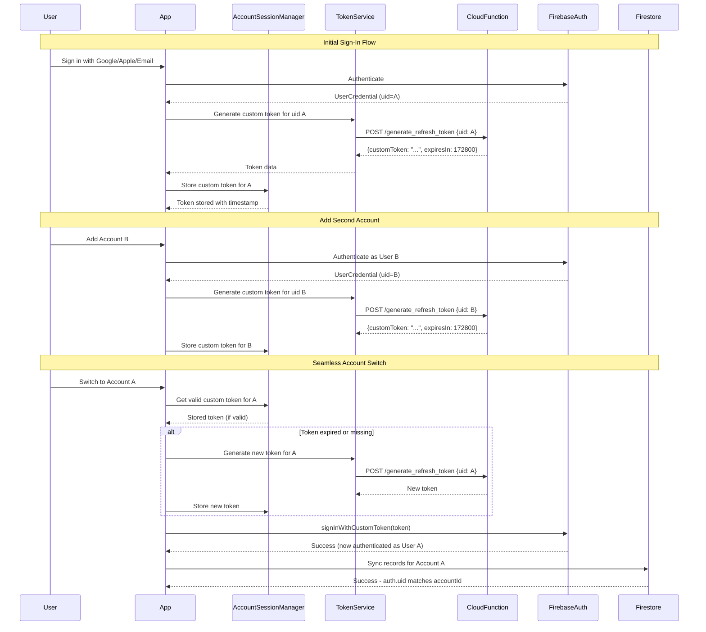

# Multi-Account Architecture

## Overview

AshTrail implements a sophisticated multi-account system that allows users to maintain multiple authenticated accounts simultaneously and switch between them seamlessly without re-authentication. This is achieved through Firebase Custom Tokens generated via a Google Cloud Function.

## Architecture Diagram



## Core Components

### 1. TokenService

**Location**: `lib/services/token_service.dart`

**Purpose**: Interfaces with the Cloud Function to generate Firebase Custom Tokens.

**Key Methods**:
- `generateCustomToken(String uid)`: Calls Cloud Function to generate a 48-hour valid custom token
- `isEndpointReachable()`: Checks connectivity to the Cloud Function

**Cloud Function Endpoint**:
```
https://us-central1-smokelog-17303.cloudfunctions.net/generate_refresh_token
```

**Request Format**:
```json
{
  "uid": "firebase-user-id"
}
```

**Response Format**:
```json
{
  "customToken": "firebase-custom-token-string",
  "expiresIn": 172800
}
```

### 2. AccountSessionManager

**Location**: `lib/services/account_session_manager.dart`

**Purpose**: Manages custom tokens and account sessions securely.

**Key Methods**:
- `storeCustomToken(String uid, String customToken)`: Stores token with timestamp
- `getValidCustomToken(String uid)`: Returns token if valid (< 47 hours old)
- `removeCustomToken(String uid)`: Cleans up expired/invalid tokens
- `hasValidCustomToken(String uid)`: Checks if valid token exists

**Storage**:
- Tokens stored in `FlutterSecureStorage` with keys:
  - `custom_token_{uid}`: The token string
  - `custom_token_timestamp_{uid}`: Timestamp when token was received

**Expiration Logic**:
- Tokens are considered valid for 47 hours (1-hour buffer before 48-hour Firebase limit)
- Expired tokens are automatically removed when retrieved

### 3. Account Integration Service

**Location**: `lib/services/account_integration_service.dart`

**Purpose**: Handles account creation and token generation on initial sign-in.

**Key Flow**:
1. User authenticates via Firebase Auth (Google/Apple/Email)
2. `syncAccountFromFirebaseUser()` is called
3. Account is created/updated in local storage
4. `_generateAndStoreCustomToken()` is called automatically
5. Custom token is stored for future seamless switching

**Error Handling**:
- Token generation failures are non-fatal
- User can still use the app, but may need to re-authenticate when switching accounts

### 4. Account Switcher

**Location**: `lib/providers/account_provider.dart`

**Purpose**: Handles account switching logic with seamless authentication.

**Key Method**: `AccountSwitcher.switchAccount(String userId)`

**Flow**:
1. Check if already authenticated as target user → Skip if yes
2. Try to retrieve valid custom token from storage
3. If no valid token:
   - Generate new token via Cloud Function
   - Store token with timestamp
4. Sign in with `FirebaseAuth.signInWithCustomToken(customToken)`
5. Update active account in local storage
6. Invalidate providers to refresh UI

**Error Handling**:
- If token generation fails, account switch still works locally
- Sync operations will fail until token can be generated
- User can manually re-authenticate if needed

### 5. Sync Service

**Location**: `lib/services/sync_service.dart`

**Purpose**: Synchronizes local data with Firestore, ensuring account isolation.

**Key Safety Features**:
- `syncPendingRecords()` filters by authenticated Firebase user
- Only syncs records where `record.accountId == FirebaseAuth.currentUser.uid`
- Prevents cross-account data leakage

**Filtering Logic**:
```dart
final firebaseUser = FirebaseAuth.instance.currentUser;
if (firebaseUser == null) {
  return SyncResult(/* no authenticated user */);
}

final pendingRecords = await _logRecordService.getPendingSync(
  accountId: firebaseUser.uid,  // Only sync records for this user
  limit: _batchSize,
);
```

## Data Flow

### Account Creation Flow

```
1. User signs in (Google/Apple/Email)
   ↓
2. Firebase Auth authenticates → UserCredential
   ↓
3. AccountIntegrationService.syncAccountFromFirebaseUser()
   ↓
4. Account created/updated in local storage
   ↓
5. TokenService.generateCustomToken(uid)
   ↓
6. Cloud Function generates custom token
   ↓
7. AccountSessionManager.storeCustomToken(uid, token)
   ↓
8. Account ready for seamless switching
```

### Account Switching Flow

```
1. User selects Account B from UI
   ↓
2. AccountSwitcher.switchAccount(userIdB)
   ↓
3. Check: Already authenticated as B? → Yes: Skip auth
   ↓
4. AccountSessionManager.getValidCustomToken(userIdB)
   ↓
5. Token valid? → Yes: Use stored token
   ↓
6. Token expired/missing? → Generate new token
   ↓
7. FirebaseAuth.signInWithCustomToken(token)
   ↓
8. Firebase Auth now = User B (instant, no UI)
   ↓
9. AccountSessionManager.setActiveAccount(userIdB)
   ↓
10. Providers invalidated → UI refreshes
   ↓
11. Sync operations now work for Account B
```

### Sync Flow

```
1. SyncService.syncPendingRecords() called
   ↓
2. Get current Firebase Auth user
   ↓
3. Filter pending records: accountId == auth.uid
   ↓
4. For each record:
   - Upload to Firestore: accounts/{accountId}/logs/{logId}
   - Firestore security rules verify auth.uid matches accountId
   - Mark as synced on success
```

## Security Considerations

### Token Security

- **Storage**: Custom tokens stored in `FlutterSecureStorage` (encrypted at rest)
- **Expiration**: Tokens expire after 48 hours (Firebase limit)
- **Regeneration**: Tokens automatically regenerated when expired
- **Cleanup**: Tokens removed when account is signed out

### Data Isolation

- **Firestore Rules**: Enforce `request.auth.uid == accountId` for all writes
- **Sync Filtering**: Only sync records matching authenticated user
- **Query Filtering**: All data queries filter by active account's `userId`
- **No Cross-Account Access**: Impossible to sync data to wrong account

### Cloud Function Security

- **Authentication**: Cloud Function uses Firebase Admin SDK
- **Validation**: Only generates tokens for valid Firebase user IDs
- **Rate Limiting**: Cloud Function should implement rate limiting (backend concern)

## Error Handling

### Token Generation Failures

**Scenario**: Cloud Function unavailable or returns error

**Handling**:
- Account switch still works locally (data viewing)
- Sync operations will fail until token can be generated
- User can manually re-authenticate if needed
- App continues to function in offline mode

### Token Expiration

**Scenario**: Stored token is older than 47 hours

**Handling**:
- Token automatically removed from storage
- New token generated on next account switch
- No user interaction required

### Network Failures

**Scenario**: No network when switching accounts

**Handling**:
- If valid token exists: Can still switch (token already generated)
- If token expired: Switch works locally, sync will fail until online
- App continues to function offline

## Testing Considerations

### Unit Tests

- Mock `TokenService` to avoid actual Cloud Function calls
- Mock `AccountSessionManager` to control token storage
- Test token expiration logic
- Test error handling scenarios

### Integration Tests

- Test actual account switching flow
- Verify Firebase Auth state changes
- Verify sync filtering works correctly
- Test token regeneration on expiration

### E2E Tests

- Test multi-account sign-in flow
- Test seamless account switching
- Verify data isolation between accounts
- Test sync behavior per account

## Future Enhancements

### Potential Improvements

1. **Token Refresh Proactive**: Refresh tokens before expiration (e.g., at 40 hours)
2. **Token Caching**: Cache multiple tokens for faster switching
3. **Offline Token Validation**: Validate token format locally before use
4. **Token Rotation**: Implement token rotation for enhanced security
5. **Multi-Device Sync**: Ensure tokens work across devices

### Limitations

- **48-Hour Limit**: Firebase Custom Tokens have a 48-hour validity limit
- **Cloud Function Dependency**: Requires Cloud Function to be available
- **Single Active Auth**: Firebase Auth only supports one active user at a time

## Related Documentation

- [Authentication & Accounts Design Doc](docs/plan/8.%20Authentication%20&%20Accounts.md)
- [Logging System Design Doc](docs/plan/5.%20Logging%20System.md)
- [Data Persistence Design Doc](docs/plan/7.%20Data%20Persistence.md)

## Implementation Files

- `lib/services/token_service.dart` - Token generation service
- `lib/services/account_session_manager.dart` - Token storage and management
- `lib/services/account_integration_service.dart` - Account creation and token generation
- `lib/providers/account_provider.dart` - Account switching logic
- `lib/services/sync_service.dart` - Sync with account filtering
- `lib/services/log_record_service.dart` - Account-scoped data queries
