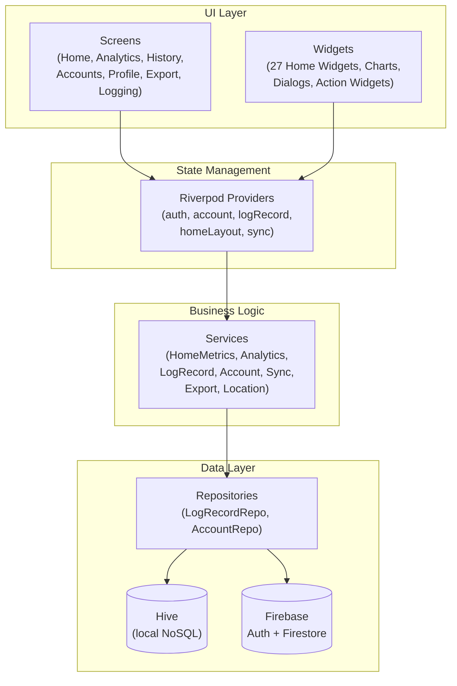
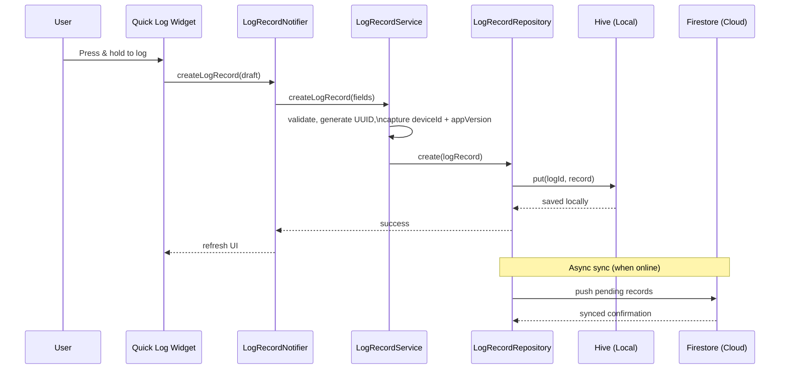
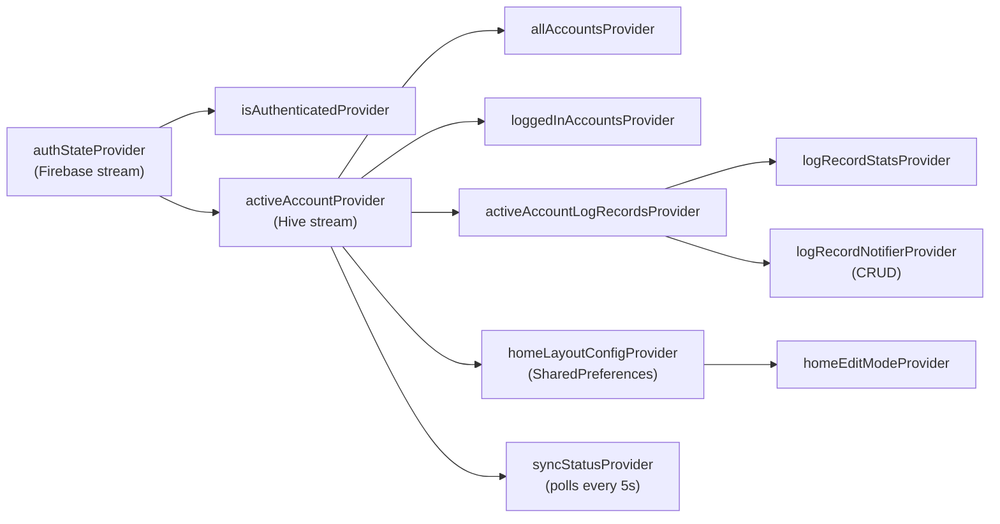
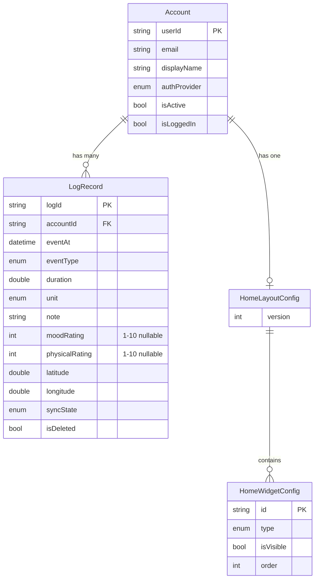

# Architecture & Data Flow

This file contains four diagrams that visualize how Ash Trail is structured internally. These are the "re-orient after months away" diagrams — start here when you need to remember how the pieces fit together.

← [Back to Index](README.md)

---

## Layer Architecture

Ash Trail follows a strict 4-layer architecture. The UI layer (screens and widgets) reads state from Riverpod providers. Providers delegate business logic to services. Services use repositories for data access. Repositories abstract over Hive (local storage) and Firebase (cloud). The key rule is: **no layer may skip levels** — a screen never calls a repository directly, and a widget never calls a service directly.

> **Key takeaway:** Data flows down through providers → services → repositories. The UI never touches persistence directly.

---

## Data Flow for a Log Entry

This sequence diagram traces the exact path of a single log [entry](glossary.md#entry) from user tap to persistent storage. The user presses the Quick Log widget, which calls the LogRecordNotifier provider. The provider delegates to LogRecordService for validation and UUID generation. The service calls the repository to write to Hive. The UI refreshes immediately (optimistic update). Later, SyncService asynchronously pushes pending records to Firestore. This is why the app works offline — the local save happens first, and the cloud sync is fire-and-forget.

> **Key takeaway:** The local save to Hive completes before any cloud sync attempt, ensuring zero data loss regardless of network state.

---

## Provider Dependency Graph

This diagram shows how Riverpod providers depend on each other. The `authStateProvider` is the root — it streams Firebase auth state changes. When the user signs in, `activeAccountProvider` watches Hive for the active account. All other providers (records, layout, sync) derive from the active account. This means **switching accounts automatically refreshes ALL data** in the app because every provider chain starts from `activeAccountProvider`. This is the core mechanism behind [multi-account](glossary.md#entry) support.

> **Key takeaway:** The `activeAccountProvider` is the lynchpin — every piece of data displayed in the app traces back to which account is currently active.

---

## Data Model (Entity Relationship)

This diagram shows the four core data models and their relationships. An Account has many LogRecords (one-to-many via `accountId` foreign key). An Account has one HomeLayoutConfig (its personal widget arrangement). A HomeLayoutConfig contains many HomeWidgetConfig entries (each representing one widget instance with its type, order, and visibility). The `LogRecord` is the central entity — it is what every widget, chart, and metric is built from. Note the key nullable fields: `moodRating`, `physicalRating`, `latitude`, `longitude` — these are only populated when the user opts to provide them.

> **Key takeaway:** `LogRecord` is the central entity — every widget, chart, and metric computation reads from it. The other models support account management and dashboard customization.

---

← [Back to Index](README.md)
