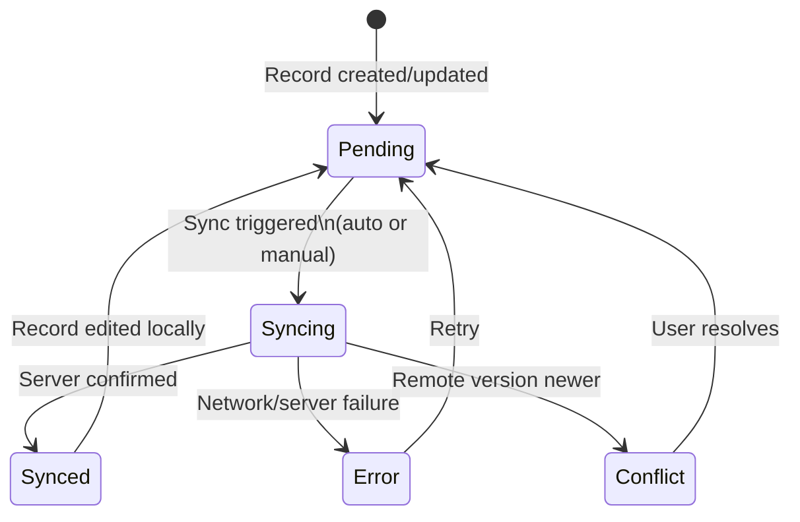

# Data, Sync & Export

This file covers how data is stored locally, synced to the cloud, and exported. Ash Trail uses an offline-first architecture — every action saves to the device first, and cloud sync happens asynchronously in the background.

← [Back to Index](README.md)

---

## Offline-First Storage

All data is saved to **Hive** (a lightweight NoSQL key-value store) on the device the instant you log an [entry](glossary.md#entry). The app works fully without an internet connection. No data is lost if you're offline — entries queue for sync when connectivity returns. You can log entries, edit them, delete them, and browse your history entirely offline.

## Cloud Sync

When the device is online, `SyncService` automatically pushes records with [sync state](glossary.md#sync-state) `pending` to Firestore (Google Cloud). It also watches Firestore in real-time for changes pushed from other devices (if you log in on multiple devices).

**When sync triggers:**
- **On app startup:** An immediate pull + push runs when you sign in or switch accounts
- **Periodic auto-sync:** Push and pull both run every 30 seconds via background timers
- **Manual trigger:** Available via force-sync if needed
- **On account switch:** Switching accounts triggers an immediate sync for the new account

**Push logic:** Up to 50 pending records are batched per sync cycle. Each record is re-checked before upload to detect concurrent modifications. Records are uploaded to Firestore at the path `accounts/{accountId}/logs/{logId}`. After upload, the record is re-verified before marking as synced — this guards against edits made during the upload window.

**Pull logic:** Queries Firestore for records ordered by update time, limited to 100 per pull. New records are imported locally. For existing records, updates are applied only if the remote version has a newer `updatedAt` timestamp (last-write-wins conflict resolution).

**Multi-account sync:** The service can sync all logged-in accounts sequentially. It temporarily switches Firebase Auth via custom tokens, syncs each account's records, then restores the original auth state.

---

## Sync State Machine

Every entry has a [sync state](glossary.md#sync-state) that tracks its position in the sync lifecycle:



> **Key takeaway:** Records start as `pending`, transition through `syncing`, and land at `synced` — or at `error`/`conflict` if something goes wrong. Errors auto-retry on the next sync cycle.

### State Descriptions

| State | Description |
|-------|-------------|
| **Pending** | Saved locally, not yet uploaded. This is the initial state for new and edited records. |
| **Syncing** | Upload in progress. Brief transitional state — usually lasts less than a second. |
| **Synced** | Server confirmed receipt. The record's `syncedAt` timestamp is set. This is the "done" state. |
| **Error** | Upload failed due to network issues or server errors. The record stays in the local database and will be retried on the next sync cycle. No data is lost. |
| **Conflict** | The server has a newer version of this record (e.g., you edited it on another device). Currently resolved by last-write-wins (newer `updatedAt` wins). |

---

## Export Formats

Export is available from the [ExportScreen](screens.md) (Accounts → Export). Both formats copy data to the clipboard. Export only includes entries for the currently active account.

### CSV Export

Flat format with one row per entry. 15 columns:

```
logId, accountId, eventType, eventAt, duration, unit, note, moodRating,
physicalRating, latitude, longitude, source, syncState, createdAt, updatedAt
```

- Notes are double-quote escaped; newlines become `\n`; quotes become `""`
- Nullable fields output as empty strings
- Good for importing into spreadsheets (Excel, Google Sheets)

### JSON Export

Full-fidelity format preserving all field types, nested objects, and metadata. Wrapped in an envelope:

```json
{
  "version": "1.0.0",
  "exportedAt": "2026-02-09T...",
  "recordCount": 42,
  "records": [...]
}
```

Each record includes 22 fields including `reasons` (as a list of names), `timeConfidence`, `isDeleted`, `deletedAt`, `revision`, and `deviceId`. Pretty-printed with 2-space indentation. Good for backup or data transfer between devices.

### Import

Import supports both CSV and JSON from clipboard. The CSV importer validates required headers (`logid`, `accountid`, `eventtype`, `eventat`). The JSON importer validates the `records` array structure. Both return results with parsed records, skipped count, and error details. Conflict resolution options include: skip, replace, or merge.

> **Note:** Import is a planned feature. The UI exists but is currently disabled with a "coming soon" indicator.

---

## Data Scoping

Export only includes entries for the **currently active account**. It does not export entries from other logged-in accounts. If you want to export all accounts, you must switch to each account and export separately.

All widget calculations, chart data, and history views are similarly scoped to the active account. Switching accounts refreshes all data.

---

← [Back to Index](README.md)
