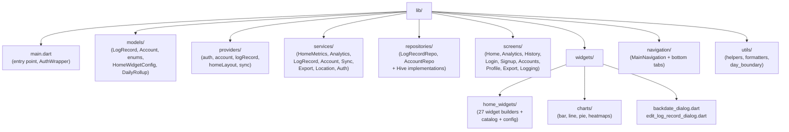

# Developer Quick-Start: Where Is X?

This file is your lifeline when you come back after weeks or months and need to find where something is implemented. Every row answers a concrete question with an exact file path.

← [Back to Index](README.md)

---

## File Map by Concern

| I want to… | Look in… |
|------------|----------|
| Change a screen layout | `lib/screens/{screen_name}_screen.dart` |
| Add/modify a home widget | `lib/widgets/home_widgets/` + register in `widget_catalog.dart` |
| Change a widget's calculation | `lib/services/home_metrics_service.dart` |
| Add a new chart | `lib/widgets/charts/` |
| Change analytics logic | `lib/services/analytics_service.dart` |
| Modify the data model | `lib/models/log_record.dart` or `lib/models/account.dart` |
| Change auth flow | `lib/services/account_integration_service.dart` |
| Fix sync issues | `lib/services/sync_service.dart` |
| Change data persistence | `lib/repositories/*_hive.dart` |
| Add a new provider | `lib/providers/` |
| Update navigation/tabs | `lib/navigation/main_navigation.dart` |
| Modify the log form | `lib/screens/logging_screen.dart` or `lib/widgets/backdate_dialog.dart` |
| Change export format | `lib/services/export_service.dart` |
| Update enums (event types, reasons) | `lib/models/enums.dart` |
| Change day boundary (6 AM) | `lib/utils/day_boundary.dart` |
| Fix crash reporting | `lib/services/crash_reporting_service.dart` |
| Change location capture | `lib/services/location_service.dart` |
| Validate data integrity | `lib/services/data_integrity_service.dart` |
| Modify token management | `lib/services/token_service.dart` |
| Change notification behavior | `lib/services/notification_service.dart` |
| Run tests | `test/` (unit), `integration_test/` (integration) |
| Deploy to TestFlight | `./scripts/deploy_testflight.sh` |
| CI/CD config | `.github/workflows/` or `ios/fastlane/` |

---

## Folder Structure

---

## Key Files Quick Reference

| File | Purpose |
|------|---------|
| `lib/main.dart` | App entry point, Firebase init, `AuthWrapper` routing |
| `lib/models/log_record.dart` | Core data model — 26 fields, Hive adapter, Firestore serialization |
| `lib/models/account.dart` | Account model — multi-account support, auth tokens |
| `lib/models/enums.dart` | All enum types: EventType, SyncState, Unit, LogReason, Source, etc. |
| `lib/models/home_widget_config.dart` | Widget layout config — type, order, visibility, settings |
| `lib/widgets/home_widgets/widget_catalog.dart` | Authoritative list of all 27 widget types with metadata |
| `lib/widgets/home_widgets/home_widget_builder.dart` | Switch statement mapping widget type → builder function |
| `lib/services/home_metrics_service.dart` | All widget calculation logic — this is where the math lives |
| `lib/services/analytics_service.dart` | Chart data computation, daily rollups, trend analysis |
| `lib/services/sync_service.dart` | Bidirectional Firestore sync, multi-account, conflict resolution |
| `lib/services/export_service.dart` | CSV/JSON export and import logic |
| `lib/services/log_record_service.dart` | CRUD operations, validation, UUID generation |
| `lib/utils/day_boundary.dart` | 6 AM day boundary logic (`dayStartHour = 6`) |
| `lib/navigation/main_navigation.dart` | Bottom tab bar: Home, Analytics, History |

---

## Services Inventory

| Service | Responsibility |
|---------|---------------|
| `account_integration_service.dart` | Multi-account auth orchestration |
| `account_service.dart` | Account CRUD, activation |
| `account_session_manager.dart` | Session and token lifecycle |
| `analytics_service.dart` | Chart data, daily rollups, trend direction |
| `auth_service.dart` | Firebase Auth wrapper |
| `crash_reporting_service.dart` | Firebase Crashlytics integration |
| `data_integrity_service.dart` | Data validation and consistency checks |
| `database_service.dart` | Database abstraction layer |
| `export_service.dart` | CSV/JSON export and import |
| `hive_database_service.dart` | Hive initialization and box management |
| `home_metrics_service.dart` | All widget metric calculations |
| `legacy_data_adapter.dart` | Migration from old data formats |
| `location_service.dart` | GPS capture and permissions |
| `log_record_service.dart` | Entry CRUD, validation, UUID generation |
| `notification_service.dart` | Push notification handling |
| `sync_service.dart` | Bidirectional Firestore sync |
| `token_service.dart` | Custom token management for account switching |
| `validation_service.dart` | Input validation rules |

---

## Chart Files

| File | Chart Type |
|------|-----------|
| `lib/widgets/charts/activity_bar_chart.dart` | Daily activity bar chart |
| `lib/widgets/charts/activity_line_chart.dart` | Daily activity line chart |
| `lib/widgets/charts/event_type_pie_chart.dart` | Event type breakdown pie chart |
| `lib/widgets/charts/hourly_heatmap.dart` | Hourly/weekday/weekend activity heatmaps |
| `lib/widgets/charts/time_range_picker.dart` | Time range selection component |
| `lib/widgets/charts/charts.dart` | Barrel export / shared utilities |

---

## Common Commands

| Task | Command |
|------|---------|
| Run app | `flutter run` |
| Run tests | `flutter test` |
| Run integration tests | `flutter test integration_test/` |
| Build iOS | `flutter build ios` |
| Deploy TestFlight | `./scripts/deploy_testflight.sh` |
| Deploy (skip tests) | `SKIP_TESTS=1 ./scripts/deploy_testflight.sh` |
| Generate coverage | `flutter test --coverage && genhtml coverage/lcov.info -o coverage/html` |
| Clean build | `flutter clean && flutter pub get` |

---

## How to Add a New Widget

Follow these steps to add a new widget to the home screen:

1. **Define the enum** — Add a new value to `HomeWidgetType` in `lib/widgets/home_widgets/widget_catalog.dart`
2. **Register in catalog** — Add a `WidgetCatalogEntry` in the `WidgetCatalog.entries` map with display name, description, icon, category, and size
3. **Add calculation** — Add a public method in `lib/services/home_metrics_service.dart` that computes the metric
4. **Add builder** — Add a case in the switch statement in `lib/widgets/home_widgets/home_widget_builder.dart` that returns the widget
5. **Build the widget** — Create the widget UI (typically using `StatCardWidget` for stat cards, or a custom widget for visual/interactive widgets)

See the [Widget Catalog](widgets/README.md) for detailed documentation of all existing widgets and the [rendering pipeline diagram](widgets/README.md).

---

← [Back to Index](README.md)
