# Key Concepts & Glossary

This file defines domain-specific terms used throughout all Ash Trail documentation. Other files link here instead of re-defining terms.

← [Back to Index](README.md)

---

### Day Boundary

A "day" in Ash Trail runs from **6:00 AM to 5:59 AM** the next calendar day. This means an entry at 2:00 AM on Tuesday is counted as part of **Monday** in all widgets, charts, and calculations. This is the single most important concept in the app — it affects every metric.

The 6 AM value is defined as `dayStartHour = 6` in the day boundary utility. The logic checks `dateTime.hour < 6`: if true, the timestamp belongs to the previous calendar day's logical period.

**Why 6 AM?** Late-night usage naturally belongs with "today's" activity rather than the next calendar day. Most users are asleep by 6 AM, making it a natural boundary between usage days.

```mermaid
graph LR
    subgraph "Logical MONDAY"
        A["Mon 6:00 AM"] --> B["Mon 8:00 PM\n✅ = Monday"]
        B --> C["Tue 2:00 AM\n✅ = Monday"]
        C --> D["Tue 5:59 AM\n✅ = Monday"]
    end
    subgraph "Logical TUESDAY"
        E["Tue 6:00 AM\n🔵 = Tuesday"] --> F["..."]
    end
    D -->|"Day boundary"| E

    style A fill:#1a237e,color:#fff
    style E fill:#1a237e,color:#fff
```

> **Key takeaway:** Any timestamp before 6 AM rolls back to the previous logical day.

---

### Entry

A single recorded event (usage session). Also called a **hit** or **log** — these three words are used interchangeably throughout the app. Each entry is stored as a `LogRecord` in the database with a unique UUID.

An entry captures: when it happened, what type of event it was, how long it lasted, and optional metadata (notes, mood, physical rating, reasons, location).

---

### Duration

Length of a single entry measured in **seconds** internally. Displayed to the user as mm:ss (e.g., "2:30") or hh:mm:ss for longer sessions. Duration is captured either by manual numeric input or by press-and-hold timing in the Quick Log widget.

If the unit is set to `minutes`, the stored value is converted to seconds (multiplied by 60) before any calculation.

---

### Event Type

Category of an entry. The exact values from the `EventType` enum are:

| Value | Description |
|-------|-------------|
| `vape` | Vaping session |
| `inhale` | Single inhale/hit |
| `sessionStart` | Start of a session |
| `sessionEnd` | End of a session |
| `note` | General note/observation |
| `purchase` | Purchase tracking |
| `tolerance` | Tolerance note |
| `symptomRelief` | Medical symptom tracking |
| `custom` | Custom event type |

Each event type has an associated icon and display name in the UI.

---

### Unit

Unit of measurement for an entry's duration. Values from the `Unit` enum:

| Value | Description |
|-------|-------------|
| `seconds` | Duration in seconds (default for Quick Log) |
| `minutes` | Duration in minutes |
| `hits` | Number of hits/inhales |
| `mg` | Milligrams |
| `grams` | Grams |
| `ml` | Milliliters |
| `count` | Generic count |
| `none` | No unit |

---

### Log Reason

Optional context for why the user logged an entry. Multiple reasons can be selected per entry. Values from the `LogReason` enum:

| Value | Display Name | Icon |
|-------|-------------|------|
| `medical` | Medical | 🏥 Medical services |
| `recreational` | Recreational | 🎉 Celebration |
| `social` | Social | 👥 People |
| `stress` | Stress Relief | 🧘 Spa |
| `habit` | Habit | 🔁 Repeat |
| `sleep` | Sleep Aid | 🌙 Bedtime |
| `pain` | Pain Management | 💊 Healing |
| `other` | Other | ··· More |

---

### Trend Indicator

A small colored badge with an arrow and percentage shown on many widgets. Color-coded with an **intentionally inverted** convention:

- **Green with down-arrow (↓)** = usage decreased = positive progress toward reduction
- **Red with up-arrow (↑)** = usage increased = concerning

This is the **opposite** of typical "green = up" patterns because in a harm-reduction app, *less* usage is the desired direction. See [Understanding Trend Indicators](trends.md) for full details.

Some widgets (like mood/physical averages) use the standard convention where green ↑ = good (rating improved).

---

### Gap

Elapsed time between two consecutive entries, measured from the timestamp of one record to the timestamp of the next. Used by time-based widgets like Average Gap and Longest Gap Today. Calculated as the difference between `eventAt` values of sequential records sorted by time.

---

### Active Hour

A clock hour (e.g., 2:00 PM–2:59 PM) during which at least one entry was recorded. Used by the Active Hours widget to show how many distinct hours had activity, and by Hits/Active Hour to calculate usage density. The count is the size of the set of unique `eventAt.hour` values across today's entries.

---

### Widget Size

Widget size designations that control layout on the home screen:

| Size | Behavior |
|------|----------|
| **Compact** | Half the screen width; automatically paired side-by-side with another compact widget |
| **Standard** | Full screen width, normal height |
| **Large** | Full screen width with extra vertical height (used for heatmaps, Quick Log, Recent Entries) |

These sizes are defined in the `WidgetSize` enum in the widget catalog.

---

### Soft Delete

When a user swipes to delete an entry, it is **not** removed from the database. Instead, `isDeleted` is set to `true` and the entry is hidden from the UI. A snackbar with "Undo" appears for several seconds. If tapped, `isDeleted` is set back to `false`. Soft-deleted records are still synced to Firestore and included in exports.

All widget calculations explicitly filter out soft-deleted records (`isDeleted == true`).

---

### Sync State

Every entry has a `syncState` field that tracks its cloud sync status. The exact values from the `SyncState` enum:

| State | Description |
|-------|-------------|
| `pending` | Saved locally, not yet synced. This is the initial state for new records. |
| `syncing` | Upload in progress. Brief transitional state. |
| `synced` | Server confirmed receipt. The record's `syncedAt` timestamp is set. |
| `error` | Sync failed (network issue, server error). Will be retried on next sync cycle. |
| `conflict` | Server has a newer version (e.g., edited on another device). Requires resolution. |

See [Data, Sync & Export](data-sync.md) for the full sync state machine and resolution logic.

---

### Source

Where a record originated. Values from the `Source` enum:

| Value | Description |
|-------|-------------|
| `manual` | Manually entered by the user (default) |
| `imported` | Imported from CSV/JSON |
| `automation` | Auto-generated |
| `migration` | Migrated from old system |

---

### Time Confidence

How much to trust the timestamp of an entry. Used for backdated entries where the time is an estimate. Values:

| Value | Description |
|-------|-------------|
| `high` | Device time is trusted (default — real-time entries) |
| `medium` | Minor time discrepancy detected |
| `low` | Significant clock skew or manual backdate |

Backdated entries are automatically marked with lower time confidence.

---

← [Back to Index](README.md)
