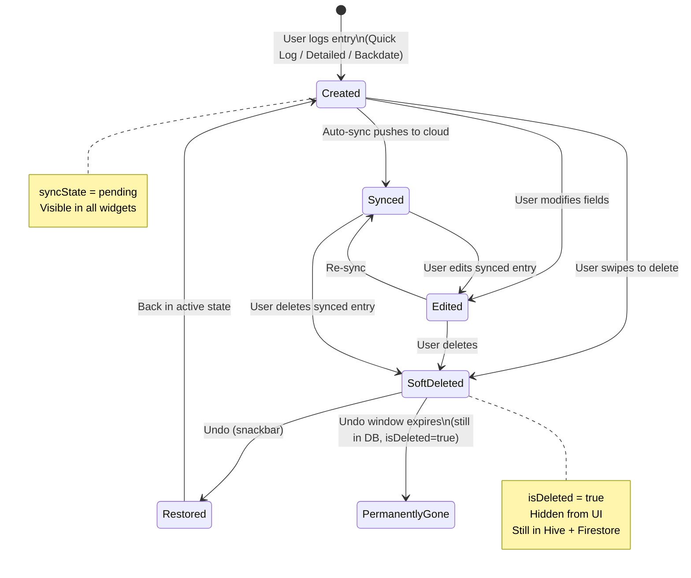

# Logging & Entry Fields Reference

This file documents all fields you can record on a log entry, the three ways to create entries, and the lifecycle of an entry from creation to sync. This is your field-by-field reference for understanding what gets stored when you log.

← [Back to Index](README.md)

---

## Entry Field Reference

| Field | Type | Required | Range/Options | Description |
|-------|------|----------|---------------|-------------|
| Event type | enum | yes | vape, inhale, session start/end, note, purchase, tolerance, symptom relief, custom | Category of the entry (see [glossary](glossary.md#event-type)) |
| Duration | number | yes | ≥ 1 second | How long the session lasted (manual input or press-and-hold) |
| Unit | enum | auto | seconds, minutes, hits, mg, grams, ml, count, none | Unit for duration (defaults to seconds for Quick Log) |
| Date/Time | datetime | auto | any past time (up to 30 days) | When it happened (auto = now, or backdated) |
| Notes | text | no | free text | Your own notes about the entry |
| Reasons | multi-select | no | Medical, Recreational, Social, Stress Relief, Habit, Sleep Aid, Pain Management, Other | Why you logged this entry (see [glossary](glossary.md#log-reason)) |
| Mood rating | slider | no | 1–10 | Subjective mood at time of entry (1 = worst, 10 = best) |
| Physical rating | slider | no | 1–10 | Subjective physical feeling (1 = worst, 10 = best) |
| Location | GPS coords | auto | lat/long (WGS84) | Auto-captured if location permission granted |

**Auto-populated fields** (not user-editable):

| Field | Description |
|-------|-------------|
| `logId` | Unique UUID generated on creation |
| `accountId` | ID of the active account |
| `createdAt` | Timestamp when the record was created |
| `updatedAt` | Timestamp of the last modification |
| `source` | Origin of the record (manual, imported, automation, migration) |
| `deviceId` | Identifier of the device that created the entry |
| `appVersion` | App version string at time of creation |
| `timeConfidence` | How reliable the timestamp is (high for real-time, low for backdated) |
| `isDeleted` | Soft-delete flag (default false) |
| `syncState` | Cloud sync status (default pending) |
| `revision` | Conflict resolution counter |

---

## Three Ways to Log

### Quick Log (Home Screen Widget)

The fastest option. Press and hold the Quick Log button on the home screen to record duration in real-time. Best for in-the-moment logging when you just want to capture how long a session lasted.

- **Hardcoded values:** `eventType = vape`, `unit = seconds`
- **Optional inputs:** Mood slider (1–10), physical slider (1–10), and reason chips are available below the button
- **Location:** Auto-captured if permission granted
- **1-second minimum:** Holds shorter than 1 second are ignored to prevent accidental logs from brief taps

### Detailed Logging (LoggingScreen, "Detailed" Tab)

The full form with all fields. Best when you want to record event type, custom duration, notes, reasons, mood, physical, and location. Use this when the entry isn't a simple vape session.

**Fields available (in order):**
1. Event Type — dropdown with all event types
2. Duration — manual numeric input (seconds), or press-and-hold circle button to time it
3. Reason — multi-select chips from all reason values
4. Mood Rating — slider (1–10, clearable)
5. Physical Rating — slider (1–10, clearable)
6. Notes — multi-line text field
7. Location — auto-collected with map preview, "Edit on Map" and "Recapture" buttons

### Backdate (LoggingScreen "Backdate" Tab, or FAB on HomeScreen)

For logging something that happened in the past. Provides a date/time picker plus quick-offset buttons. Use this when you forgot to log at the moment it happened. Backdated entries are marked with lower [time confidence](glossary.md#time-confidence). Entries can be backdated up to 30 days in the past.

**Quick-offset buttons:**
- **-5m** — sets the time to 5 minutes ago
- **-15m** — sets the time to 15 minutes ago
- **-30m** — sets the time to 30 minutes ago
- **-1h** — sets the time to 1 hour ago

Tapping a quick-offset button pre-fills the date/time picker with that offset from the current time.

---

## How Mood and Physical Ratings Work

The mood (1–10) and physical (1–10) sliders save values on the entry. By default, they are null (not set). You must explicitly move the slider to set a rating. You can clear a rating to set it back to null.

- **1** = worst — terrible mood or physical state
- **10** = best — great mood or physical state

The [Mood/Physical Avg widget](widgets/secondary-data.md#moodphysical-avg) computes the average of all non-null ratings. Entries without ratings are excluded from the average (not treated as zero). This means if 3 out of 10 entries have mood ratings, only those 3 contribute to the average.

---

## Entry Lifecycle

**Key points:**
- New entries start with `syncState = pending` and are immediately visible in all widgets
- [Soft-deleted](glossary.md#soft-delete) entries have `isDeleted = true` — they are hidden from the UI but remain in the database and are still synced to Firestore
- After the undo window expires, the record is still in the database with `isDeleted = true` — it is never physically removed
- Editing a synced entry resets its `syncState` back to `pending` for re-sync

---

← [Back to Index](README.md)
