# Screen Reference & Navigation

This file documents all screens in Ash Trail, how to navigate between them, and what each screen shows the user. The app uses a simple navigation model: an auth gate that routes to either the welcome flow or the main app, and a 3-tab bottom navigation bar for the main experience. All screens respect the [day boundary](glossary.md#day-boundary) — a "day" runs from 6 AM to 5:59 AM — when displaying [entries](glossary.md#entry), metrics, and charts.

← [Back to Index](README.md)

---

## Navigation Flow

```mermaid
flowchart TD
    Start(["App Launch"]) --> AuthCheck{"Authenticated?"}
    AuthCheck -->|No| Welcome["WelcomeScreen\n🔥 Sign In prompt"]
    AuthCheck -->|Yes, no active account| Welcome
    AuthCheck -->|Yes, active account| Main

    Welcome --> Login["LoginScreen\n📧 Email/Password\n🔵 Google SSO\n🍎 Apple SSO"]
    Welcome --> Signup["SignupScreen\n📝 Create account"]
    Login --> Main["MainNavigation\n(Bottom Tab Bar)"]
    Signup --> Main

    Main --> Home["🏠 HomeScreen\nCustomizable widget grid"]
    Main --> Analytics["📊 AnalyticsScreen\nCharts & summaries"]
    Main --> History["📜 HistoryScreen\nFull entry list"]

    Home -->|FAB| Backdate["BackdateDialog\n⏪ Log past event"]
    Home -->|Pencil icon| EditMode["Edit Mode\n✏️ Reorder / add / remove widgets"]
    EditMode -->|Add| WidgetPicker["Widget Picker\n📋 Bottom sheet by category"]

    History -->|Tap entry| EditLog["EditLogRecordDialog\n✏️ Modify entry"]

    Home -->|App bar| Accounts["AccountsScreen\n👤 Switch / manage accounts"]
    Accounts --> Profile["ProfileScreen\n⚙️ Name, email, password"]
    Accounts --> Export["ExportScreen\n📤 CSV / JSON"]

    Home -->|App bar| Logging["LoggingScreen\n📝 Detailed / Backdate tabs"]
```

---

## Auth State Machine

The `AuthWrapper` widget in `main.dart` determines what the user sees. It watches two providers: the Firebase auth state and the active account. This state machine shows all possible transitions:

---

## Screen Inventory

| # | Screen | How to reach | Key features |
|---|--------|-------------|---------------|
| 1 | WelcomeScreen | App launch (unauth) | Fire icon, sign-in CTA |
| 2 | LoginScreen | Welcome → Sign In | Email/pass, Google, Apple SSO |
| 3 | SignupScreen | Welcome → Create Account | Email, username, password validation |
| 4 | HomeScreen | Tab 1 (default) | Widget grid, edit mode, FAB, pull-to-refresh |
| 5 | AnalyticsScreen | Tab 2 | Summary cards, charts, time range filter |
| 6 | HistoryScreen | Tab 3 | Search, filters, grouping, swipe-to-delete |
| 7 | AccountsScreen | App bar → Accounts | Multi-account list, switch, sign out all |
| 8 | ProfileScreen | Accounts → Profile | Edit name/email, change password, delete account |
| 9 | ExportScreen | Accounts → Export | CSV/JSON export, import (planned) |
| 10 | LoggingScreen | App bar → Log | Detailed tab + Backdate tab |

---

## Screen Details

### 1. WelcomeScreen

The first screen new or unauthenticated users see. It displays the Ash Trail fire icon (🔥) at large size in the primary color, a "Welcome to Ash Trail" heading, and a "Track your sessions with ease" tagline. A single "Sign In" button navigates to the LoginScreen. There is no separate button for sign-up from this screen — that option is available on the LoginScreen.

### 2. LoginScreen

The sign-in screen with three authentication methods: email/password form fields, a Google SSO button, and an Apple SSO button. The email/password form validates the email format and requires a password of 8+ characters with at least one number. A "Create Account" link at the bottom navigates to the SignupScreen for new users.

### 3. SignupScreen

The account creation form with fields for email, display name, and password. Password validation requires 8+ characters with at least one number. On successful signup, the user is automatically signed in and routed to the MainNavigation. Error messages display inline for validation failures.

### 4. HomeScreen

The primary screen and default tab. It displays a customizable grid of [widgets](widgets/README.md) that show real-time metrics about usage patterns. Each widget uses [entries](glossary.md#entry) from the active account only. The app bar contains icons for navigating to the AccountsScreen and LoggingScreen. A floating action button (FAB) opens the BackdateDialog for logging past events. Pulling down triggers a refresh of all widget data. Tapping the pencil (✏️) icon enters [edit mode](widgets/customization.md) where you can drag-to-reorder, remove, and add widgets.

### 5. AnalyticsScreen

The second tab, focused on charts and aggregate statistics. Four summary cards at the top show total [entries](glossary.md#entry), synced count, pending count, and total [duration](glossary.md#duration). Below them, an interactive chart area supports bar charts (daily activity count or duration), line charts (trend lines), pie charts (event type breakdown), and heatmaps (hourly/weekday/weekend activity grids). A time range filter lets you select 7, 14, or 30 days, or a custom date range. A trend direction indicator shows whether usage is increasing or decreasing across the selected period by comparing the first half to the second half.

Below the charts, a list of the 10 most recent entries is displayed with event type icons, timestamps, and durations.

### 6. HistoryScreen

The third tab, showing a scrollable list of all entries for the active account. A search bar at the top filters entries in real-time as you type (searching notes text and event type names, case-insensitive). Filter controls let you narrow by [event type](glossary.md#event-type) (dropdown) and date range (start/end date pickers). A grouping selector lets you organize entries by: none (flat list), day, week, month, or event type.

Tapping any entry opens the EditLogRecordDialog to modify it. Swiping an entry left triggers a [soft delete](glossary.md#soft-delete) with an undo snackbar. Filters combine with AND logic — setting both an event type filter and date range shows only entries matching both criteria.

### 7. AccountsScreen

Accessed from the app bar on the HomeScreen. Displays a list of all accounts stored on the device. Each account shows its email, display name, auth provider icon, and active/logged-in status. Tapping an account switches to it (triggering a full provider refresh). Options include navigating to the ProfileScreen, ExportScreen, or signing out all accounts.

The multi-account model allows multiple accounts to be `isLoggedIn=true` simultaneously, but only one is `isActive=true` at a time.

### 8. ProfileScreen

Accessed from the AccountsScreen. Allows the user to edit their display name and email address, change their password, or delete their account. Changes are saved to both the local Hive store and synced to Firebase Auth. Account deletion is a destructive action with a confirmation dialog.

### 9. ExportScreen

Accessed from the AccountsScreen. Provides two export formats: CSV (flat-format, one row per entry, 15 columns) and JSON (full-fidelity with nested objects, wrapped in a metadata envelope). Both formats copy data to the clipboard. The export only includes entries for the currently active account.

An import section exists but is currently disabled with a "coming soon" note. Import will support CSV and JSON from clipboard. See [Data, Sync & Export](data-sync.md) for format details.

### 10. LoggingScreen

Accessed from the app bar on the HomeScreen. Contains two tabs: **Detailed** and **Backdate**. See [Logging & Entry Fields](logging.md) for complete field reference and the [entry](glossary.md#entry) lifecycle. The Detailed tab provides a full logging form with all fields: event type dropdown, duration input (manual or press-and-hold timer), reason chips (multi-select), mood slider (1–10), physical slider (1–10), notes text field, and auto-captured location with map preview. The Backdate tab provides a simplified interface for logging past events with quick-offset buttons (-5m, -15m, -30m, -1h) and a date/time picker. See [Logging & Entry Fields](logging.md) for complete field reference.

---

← [Back to Index](README.md)
