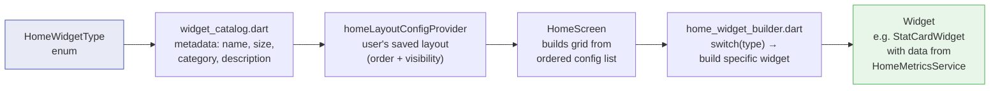

# Widget Catalog

The home screen in Ash Trail is a customizable grid of widgets. Each widget displays a specific metric, visualization, or interactive control related to your usage patterns. Widgets come in three sizes — compact (half-width, paired side-by-side), standard (full-width), and large (full-width, extra tall) — and are organized into 7 categories. There are **27 widgets** total in the catalog.

← [Back to Index](../README.md)

---

## Widget Rendering Pipeline

This diagram shows how a widget goes from an enum value to a rendered card on screen. To add a new widget, you touch all 5 boxes.

---

## Widget Summary Table

| # | Widget | Category | Size | File | One-line summary |
|---|--------|----------|------|------|------------------|
| 1 | [Time Since Last](time-based.md#time-since-last) | Time | standard | `time-based.md` | Live clock since last entry |
| 2 | [Average Gap](time-based.md#average-gap) | Time | compact | `time-based.md` | Mean time between hits |
| 3 | [Longest Gap Today](time-based.md#longest-gap-today) | Time | compact | `time-based.md` | Biggest break today |
| 4 | [First Hit Today](time-based.md#first-hit-today) | Time | compact | `time-based.md` | When you started today |
| 5 | [Last Hit Time](time-based.md#last-hit-time) | Time | compact | `time-based.md` | When + how long ago |
| 6 | [Peak Hour](time-based.md#peak-hour) | Time | compact | `time-based.md` | Busiest hour (7d) |
| 7 | [Active Hours](time-based.md#active-hours) | Time | compact | `time-based.md` | Distinct hours with activity |
| 8 | [Total Today](duration-based.md#total-today) | Duration | compact | `duration-based.md` | Sum of all durations today |
| 9 | [Avg Per Hit](duration-based.md#avg-per-hit) | Duration | compact | `duration-based.md` | Average session length |
| 10 | [Longest Hit](duration-based.md#longest-hit) | Duration | compact | `duration-based.md` | Longest single session |
| 11 | [Shortest Hit](duration-based.md#shortest-hit) | Duration | compact | `duration-based.md` | Shortest single session |
| 12 | [Total This Week](duration-based.md#total-this-week) | Duration | compact | `duration-based.md` | 7-day cumulative duration |
| 13 | [Duration Trend](duration-based.md#duration-trend) | Duration | standard | `duration-based.md` | 3-day avg vs prior 3-day |
| 14 | [Hits Today](count-based.md#hits-today) | Count | compact | `count-based.md` | Entries since 6 AM |
| 15 | [Hits This Week](count-based.md#hits-this-week) | Count | compact | `count-based.md` | 7-day total entries |
| 16 | [Daily Average](count-based.md#daily-average) | Count | compact | `count-based.md` | Avg hits/day (7d) |
| 17 | [Hits/Active Hour](count-based.md#hitsactive-hour) | Count | compact | `count-based.md` | Usage density metric |
| 18 | [Today vs Yesterday](comparison.md#today-vs-yesterday) | Comparison | standard | `comparison.md` | Side-by-side count + duration |
| 19 | [Today vs Week Avg](comparison.md#today-vs-week-avg) | Comparison | standard | `comparison.md` | % diff from 7-day baseline |
| 20 | [Weekday vs Weekend](comparison.md#weekday-vs-weekend) | Comparison | standard | `comparison.md` | Pattern comparison |
| 21 | [Weekly Pattern](pattern.md#weekly-pattern) | Pattern | standard | `pattern.md` | Day-of-week mini bar chart |
| 22 | [Weekday Heatmap](pattern.md#weekday-heatmap) | Pattern | large | `pattern.md` | Mon–Fri hourly grid |
| 23 | [Weekend Heatmap](pattern.md#weekend-heatmap) | Pattern | large | `pattern.md` | Sat–Sun hourly grid |
| 24 | [Mood/Physical Avg](secondary-data.md#moodphysical-avg) | Secondary | standard | `secondary-data.md` | Average ratings today + 7d |
| 25 | [Top Reasons](secondary-data.md#top-reasons) | Secondary | standard | `secondary-data.md` | Most common reasons (7d) |
| 26 | [Quick Log](action.md#quick-log) | Action | large | `action.md` | Press-and-hold duration logger |
| 27 | [Recent Entries](action.md#recent-entries) | Action | large | `action.md` | Last 5 entries with swipe-delete |

---

## Widget Categories

| Category | Count | Description |
|----------|-------|-------------|
| [Time-Based](time-based.md) | 7 | Analyze *when* you use and gaps between entries |
| [Duration-Based](duration-based.md) | 6 | Analyze *how long* each session lasts |
| [Count-Based](count-based.md) | 4 | Track *how many* entries you log |
| [Comparison](comparison.md) | 3 | Compare today's usage against baselines |
| [Pattern](pattern.md) | 3 | Visual widgets revealing recurring habits |
| [Secondary Data](secondary-data.md) | 2 | Mood, physical ratings, and reasons |
| [Action](action.md) | 2 | Interactive logging and reviewing |

---

See [Widget Customization](customization.md) for how to manage your widget layout (edit mode, drag-drop, defaults).

← [Back to Index](../README.md)
